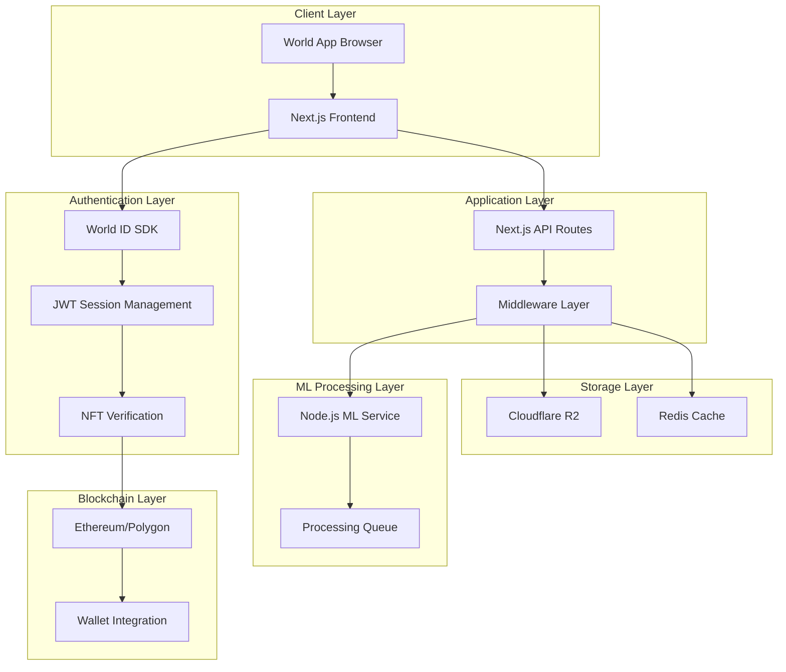

# Design Document

## Overview

The Aurum Circle Miniapp is designed as a sophisticated, exclusive dating platform that combines World ID verification, NFT-based access control, and AI-powered attractiveness scoring. The architecture follows a modern, stateless approach using Next.js 15 with App Router, Cloudflare R2 for storage, and Node.js-based ML services for image processing using TensorFlow.js and ONNX Runtime. The system emphasizes security, exclusivity, and mystique through a dark academia aesthetic and ritual-like user interactions.

## Architecture

### High-Level Architecture



### Technology Stack

- **Frontend**: Next.js 15 (App Router), TypeScript, Tailwind CSS
- **Authentication**: World ID Miniapp SDK, JWT sessions
- **Blockchain**: Viem, Wagmi for wallet integration
- **ML Processing**: Node.js + TensorFlow.js + ONNX Runtime for facial analysis
- **Storage**: Cloudflare R2 (JSON object store), Redis (caching)
- **UI Framework**: Framer Motion, Radix UI components
- **State Management**: Zustand for client state
- **Styling**: Tailwind CSS with custom dark academia theme

## Components and Interfaces

### 1. Authentication System

#### World ID Integration

```typescript
interface WorldIDConfig {
  appId: string;
  action: string;
  verificationLevel: "orb" | "device";
  maxVerifications: number;
}

interface WorldIDProof {
  merkle_root: string;
  nullifier_hash: string;
  proof: string;
  verification_level: string;
}
```

#### Session Management

```typescript
interface UserSession {
  userId: string;
  worldIdHash: string;
  walletAddress: string;
  hasNFT: boolean;
  score?: number;
  vibeTag?: string;
  inviteCode: string;
  createdAt: string;
  expiresAt: string;
}
```

### 2. NFT Verification System

#### NFT Gate Interface

```typescript
interface NFTVerification {
  walletAddress: string;
  contractAddress: string;
  tokenId?: string;
  verified: boolean;
  verifiedAt: string;
  chainId: number;
}

interface NFTGateConfig {
  requiredContracts: string[];
  minimumBalance: number;
  supportedChains: number[];
}
```

### 3. AI Scoring System

#### Node.js ML Service Interface

```typescript
interface MLScoreRequest {
  imageData: string; // base64 encoded
  userId: string;
  requestId: string;
}

interface MLScoreResponse {
  score: number; // 0-100
  confidence: number;
  faceDetected: boolean;
  qualityMetrics: {
    brightness: number;
    sharpness: number;
    faceSize: number;
  };
  processingTime: number;
}
```

#### Scoring Engine

```typescript
interface AttractivenessScore {
  userId: string;
  facialScore: number;
  universityBonus: number;
  nftBonus: number;
  finalScore: number;
  percentile: number;
  vibeCluster: string;
  scoredAt: string;
  imageHash: string;
}
```

### 4. Profile Management

#### User Profile

```typescript
interface UserProfile {
  userId: string;
  handle: string;
  vibeTag: string;
  score: number;
  badges: {
    worldId: boolean;
    nft: boolean;
    verified: boolean;
  };
  profileImage: string;
  blurredImage: string;
  createdAt: string;
  lastActive: string;
}
```

### 5. Matching System

#### Secret Signals

```typescript
interface SecretSignal {
  fromUserId: string;
  toUserId: string;
  signalType: "interest";
  sentAt: string;
  mutual: boolean;
}

interface Match {
  userId1: string;
  userId2: string;
  matchedAt: string;
  unlocked: boolean;
  conversationId?: string;
}
```

### 6. Invite System

#### Invite Management

```typescript
interface InviteCode {
  code: string;
  createdBy: string;
  usedBy?: string;
  usedAt?: string;
  active: boolean;
  expiresAt: string;
}

interface UserInvites {
  userId: string;
  activeCodes: string[];
  usedCodes: InviteCode[];
  remainingSlots: number;
  totalClaims: number;
}
```

### 7. Event Ticket System

#### NFT Event Tickets

```typescript
interface EventTicket {
  eventId: string;
  userId: string;
  ticketType: string;
  mintedAt?: string;
  expiresAt: string;
  nftTokenId?: string;
  refundEligible: boolean;
  status: "available" | "minted" | "expired" | "refunded";
}
```

## Data Models

### Storage Schema (Cloudflare R2)

#### User Data Structure

```json
{
  "users/{userId}.json": {
    "profile": UserProfile,
    "session": UserSession,
    "score": AttractivenessScore,
    "invites": UserInvites,
    "signals": SecretSignal[],
    "matches": Match[],
    "eventTickets": EventTicket[]
  }
}
```

#### Global Data Structure

```json
{
  "global/leaderboard.json": {
    "topUsers": UserProfile[],
    "lastUpdated": string
  },
  "global/stats.json": {
    "totalUsers": number,
    "averageScore": number,
    "totalMatches": number,
    "activeUsers": number
  },
  "invites/{code}.json": InviteCode,
  "events/{eventId}.json": {
    "eventDetails": EventDetails,
    "participants": string[],
    "ticketsSold": number
  }
}
```

### Redis Cache Schema

```typescript
interface CacheKeys {
  userSession: `session:${string}`;
  userScore: `score:${string}`;
  nftVerification: `nft:${string}`;
  mlProcessing: `ml:${string}`;
  rateLimit: `rate:${string}`;
  leaderboard: "leaderboard:global";
}
```

## Error Handling

### Error Types and Responses

#### Authentication Errors

```typescript
enum AuthError {
  WORLD_ID_VERIFICATION_FAILED = "WORLD_ID_VERIFICATION_FAILED",
  NFT_VERIFICATION_FAILED = "NFT_VERIFICATION_FAILED",
  SESSION_EXPIRED = "SESSION_EXPIRED",
  INVALID_SIGNATURE = "INVALID_SIGNATURE",
}
```

#### ML Processing Errors

```typescript
enum MLError {
  NO_FACE_DETECTED = "NO_FACE_DETECTED",
  POOR_IMAGE_QUALITY = "POOR_IMAGE_QUALITY",
  PROCESSING_TIMEOUT = "PROCESSING_TIMEOUT",
  SERVICE_UNAVAILABLE = "SERVICE_UNAVAILABLE",
}
```

#### Error Response Format

```typescript
interface ErrorResponse {
  error: {
    code: string;
    message: string;
    details?: any;
  };
  timestamp: string;
  requestId: string;
}
```

### Error Handling Strategy

1. **Graceful Degradation**: Fall back to cached data when services are unavailable
2. **User-Friendly Messages**: Convert technical errors to actionable user guidance
3. **Retry Logic**: Implement exponential backoff for transient failures
4. **Monitoring**: Log all errors with context for debugging
5. **Circuit Breaker**: Prevent cascade failures in ML processing

## Testing Strategy

### Unit Testing

#### Frontend Components

- World ID integration components
- Profile setup and management
- Invite system UI components
- Event ticket interface
- Score display and breakdown

#### API Endpoints

- Authentication flow validation
- NFT verification logic
- ML score processing
- Data storage operations
- Session management

#### ML Service Testing

- Face detection accuracy
- Score calculation consistency
- Performance benchmarks
- Error handling scenarios

### Integration Testing

#### Authentication Flow

```typescript
describe("Authentication Flow", () => {
  test("World ID → NFT Gate → Profile Setup", async () => {
    // Test complete authentication pipeline
  });

  test("Session persistence and expiration", async () => {
    // Test session management
  });
});
```

#### ML Processing Pipeline

```typescript
describe("ML Processing", () => {
  test("Image upload → Processing → Score generation", async () => {
    // Test end-to-end ML pipeline
  });

  test("Error handling for poor quality images", async () => {
    // Test error scenarios
  });
});
```

### End-to-End Testing

#### User Journey Testing

1. **New User Onboarding**: World ID → NFT → Profile → Scoring
2. **Matching Flow**: Browse → Signal → Mutual Match → Unlock
3. **Invite System**: Generate → Share → Redeem → Track
4. **Event Participation**: View → Mint → Expire/Refund

#### Performance Testing

- Load testing with concurrent users
- ML processing performance under load
- Storage operation latency
- Cache hit/miss ratios

### Security Testing

#### Authentication Security

- JWT token validation and expiration
- World ID proof verification
- Session hijacking prevention
- CSRF protection

#### Data Security

- Input validation and sanitization
- Image upload security
- Storage access controls
- Rate limiting effectiveness

## Implementation Considerations

### Performance Optimization

1. **Image Processing**: Optimize image size and format before ML processing
2. **Caching Strategy**: Cache scores, profiles, and leaderboards aggressively
3. **Lazy Loading**: Load profile images and data on demand
4. **CDN Integration**: Use Cloudflare CDN for static assets

### Scalability Planning

1. **Horizontal Scaling**: Design stateless services for easy scaling
2. **Database Sharding**: Plan for user data partitioning as user base grows
3. **ML Service Scaling**: Design for multiple Rust ML service instances
4. **Queue Management**: Implement proper queue management for ML processing

### Security Measures

1. **Input Validation**: Strict validation on all user inputs
2. **Rate Limiting**: Prevent abuse of ML scoring and API endpoints
3. **Image Security**: Scan uploaded images for malicious content
4. **Session Security**: Implement proper session management and CSRF protection

### Monitoring and Observability

1. **Application Metrics**: Track user engagement, conversion rates, match success
2. **Performance Metrics**: Monitor API response times, ML processing times
3. **Error Tracking**: Comprehensive error logging and alerting
4. **Business Metrics**: Track user growth, retention, and feature usage
