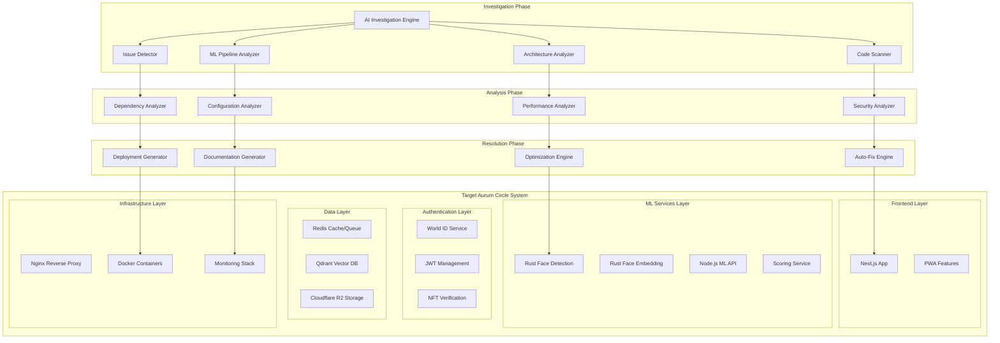

# Design Document

## Overview

This design document outlines a comprehensive AI-powered investigation and deployment system for the Aurum Circle dating platform. The system will perform deep architectural analysis, automated issue detection and resolution, and create a simplified Ubuntu server deployment solution that integrates all components into a cohesive, production-ready platform.

The Aurum Circle platform is a sophisticated dating application featuring World ID authentication, AI-powered attractiveness scoring, face detection and embedding services, vector similarity matching, and a complex microservices architecture. Our investigation system will analyze, optimize, and deploy this entire ecosystem.

## Architecture

### High-Level Investigation and Deployment Architecture



### Investigation System Architecture

The investigation system consists of multiple specialized analyzers that work together to comprehensively understand and optimize the Aurum Circle platform:

1. **AI Investigation Engine**: Orchestrates the entire investigation process
2. **Code Scanner**: Analyzes TypeScript/JavaScript/Rust source code
3. **Architecture Analyzer**: Maps system components and dependencies
4. **Issue Detector**: Identifies problems and potential improvements
5. **ML Pipeline Analyzer**: Examines the machine learning workflow

## Components and Interfaces

### 1. AI Investigation Engine

#### Core Investigation Interface

```typescript
interface InvestigationEngine {
  analyzeApplication(rootPath: string): Promise<InvestigationReport>;
  generateDeploymentPlan(report: InvestigationReport): Promise<DeploymentPlan>;
  executeDeployment(plan: DeploymentPlan): Promise<DeploymentResult>;
}

interface InvestigationReport {
  architecture: ArchitectureAnalysis;
  codeQuality: CodeQualityReport;
  security: SecurityAnalysis;
  performance: PerformanceAnalysis;
  mlPipeline: MLPipelineAnalysis;
  dependencies: DependencyAnalysis;
  issues: Issue[];
  recommendations: Recommendation[];
}

interface ArchitectureAnalysis {
  services: ServiceMap[];
  dataFlow: DataFlowDiagram;
  dependencies: DependencyGraph;
  ports: PortMapping[];
  volumes: VolumeMapping[];
  networks: NetworkConfiguration[];
}
```

#### Investigation Workflow

```typescript
class AurumInvestigationEngine {
  async investigateApplication(): Promise<InvestigationReport> {
    // Phase 1: Discovery
    const fileStructure = await this.scanFileStructure();
    const services = await this.identifyServices();
    const dependencies = await this.analyzeDependencies();

    // Phase 2: Analysis
    const codeQuality = await this.analyzeCodeQuality();
    const security = await this.performSecurityAnalysis();
    const performance = await this.analyzePerformance();
    const mlPipeline = await this.analyzeMLPipeline();

    // Phase 3: Issue Detection
    const issues = await this.detectIssues();
    const recommendations = await this.generateRecommendations();

    return {
      architecture: this.buildArchitectureMap(services, dependencies),
      codeQuality,
      security,
      performance,
      mlPipeline,
      dependencies,
      issues,
      recommendations,
    };
  }
}
```

### 2. Code Scanner and Analyzer

#### TypeScript/JavaScript Analysis

```typescript
interface CodeAnalyzer {
  scanTypeScriptFiles(paths: string[]): Promise<TypeScriptAnalysis>;
  detectCompilationErrors(files: string[]): Promise<CompilationError[]>;
  analyzeImports(files: string[]): Promise<ImportAnalysis>;
  checkCodeQuality(files: string[]): Promise<QualityMetrics>;
}

interface TypeScriptAnalysis {
  files: AnalyzedFile[];
  errors: CompilationError[];
  warnings: Warning[];
  dependencies: ImportDependency[];
  exports: ExportMapping[];
  types: TypeDefinition[];
}

interface AnalyzedFile {
  path: string;
  size: number;
  complexity: number;
  maintainabilityIndex: number;
  testCoverage: number;
  issues: CodeIssue[];
}
```

#### Rust Code Analysis

```typescript
interface RustAnalyzer {
  analyzeCargo(cargoTomlPath: string): Promise<CargoAnalysis>;
  scanRustFiles(paths: string[]): Promise<RustCodeAnalysis>;
  checkCompilation(cratePath: string): Promise<CompilationResult>;
  analyzePerformance(cratePath: string): Promise<PerformanceMetrics>;
}

interface RustCodeAnalysis {
  crates: CrateInfo[];
  dependencies: CrateDependency[];
  performance: RustPerformanceMetrics;
  safety: SafetyAnalysis;
  compilation: CompilationStatus;
}
```

### 3. ML Pipeline Analyzer

#### ML Service Analysis

```typescript
interface MLPipelineAnalyzer {
  analyzeFaceDetectionService(): Promise<MLServiceAnalysis>;
  analyzeFaceEmbeddingService(): Promise<MLServiceAnalysis>;
  analyzeMLAPI(): Promise<APIAnalysis>;
  analyzeScoringAlgorithm(): Promise<AlgorithmAnalysis>;
  analyzeVectorStore(): Promise<VectorStoreAnalysis>;
}

interface MLServiceAnalysis {
  service: string;
  technology: string;
  models: ModelInfo[];
  performance: PerformanceMetrics;
  endpoints: APIEndpoint[];
  health: HealthStatus;
  integration: IntegrationStatus;
}

interface ModelInfo {
  name: string;
  format: string; // ONNX, TensorFlow, etc.
  size: number;
  inputShape: number[];
  outputShape: number[];
  accuracy: number;
  latency: number;
}
```

#### ML Data Flow Analysis

```typescript
interface MLDataFlowAnalyzer {
  traceImageProcessingPipeline(): Promise<ProcessingPipeline>;
  analyzeEmbeddingGeneration(): Promise<EmbeddingPipeline>;
  analyzeSimilarityCalculation(): Promise<SimilarityPipeline>;
  analyzeScoreGeneration(): Promise<ScoringPipeline>;
}

interface ProcessingPipeline {
  steps: ProcessingStep[];
  dataFlow: DataTransformation[];
  performance: PipelineMetrics;
  bottlenecks: Bottleneck[];
}
```

### 4. Security Analyzer

#### Authentication Security Analysis

```typescript
interface SecurityAnalyzer {
  analyzeWorldIDIntegration(): Promise<AuthSecurityReport>;
  analyzeJWTImplementation(): Promise<JWTSecurityReport>;
  analyzeAPIEndpoints(): Promise<APISecurityReport>;
  analyzeDataStorage(): Promise<StorageSecurityReport>;
  scanForVulnerabilities(): Promise<VulnerabilityReport>;
}

interface AuthSecurityReport {
  worldIdConfig: SecurityStatus;
  tokenManagement: SecurityStatus;
  sessionHandling: SecurityStatus;
  nftVerification: SecurityStatus;
  vulnerabilities: SecurityVulnerability[];
  recommendations: SecurityRecommendation[];
}

interface JWTSecurityReport {
  secretManagement: SecurityStatus;
  tokenExpiration: SecurityStatus;
  signatureValidation: SecurityStatus;
  refreshMechanism: SecurityStatus;
  issues: JWTIssue[];
}
```

### 5. Performance Analyzer

#### System Performance Analysis

```typescript
interface PerformanceAnalyzer {
  analyzeAPIPerformance(): Promise<APIPerformanceReport>;
  analyzeMLPerformance(): Promise<MLPerformanceReport>;
  analyzeDatabasePerformance(): Promise<DatabasePerformanceReport>;
  analyzeResourceUsage(): Promise<ResourceUsageReport>;
  identifyBottlenecks(): Promise<BottleneckReport>;
}

interface APIPerformanceReport {
  endpoints: EndpointPerformance[];
  averageResponseTime: number;
  throughput: number;
  errorRate: number;
  bottlenecks: APIBottleneck[];
}

interface MLPerformanceReport {
  faceDetectionLatency: number;
  embeddingExtractionLatency: number;
  scoringLatency: number;
  memoryUsage: MemoryMetrics;
  cpuUsage: CPUMetrics;
  gpuUsage?: GPUMetrics;
}
```

### 6. Auto-Fix Engine

#### Automated Issue Resolution

```typescript
interface AutoFixEngine {
  fixTypeScriptErrors(errors: CompilationError[]): Promise<FixResult[]>;
  updateDependencies(outdated: OutdatedDependency[]): Promise<UpdateResult[]>;
  optimizeDockerfiles(dockerfiles: string[]): Promise<OptimizationResult[]>;
  fixSecurityIssues(
    vulnerabilities: SecurityVulnerability[]
  ): Promise<SecurityFixResult[]>;
  optimizeConfiguration(
    configs: ConfigFile[]
  ): Promise<ConfigOptimizationResult[]>;
}

interface FixResult {
  issue: string;
  fix: string;
  applied: boolean;
  manualStepsRequired: string[];
  impact: ImpactAssessment;
}

interface ImpactAssessment {
  risk: "low" | "medium" | "high";
  breakingChanges: boolean;
  testingRequired: boolean;
  rollbackPlan: string;
}
```

### 7. Ubuntu Deployment Generator

#### Deployment Plan Generation

```typescript
interface DeploymentGenerator {
  generateUbuntuSetup(): Promise<UbuntuSetupScript>;
  generateDockerCompose(): Promise<DockerComposeConfig>;
  generateNginxConfig(): Promise<NginxConfiguration>;
  generateSystemdServices(): Promise<SystemdService[]>;
  generateMonitoringSetup(): Promise<MonitoringConfiguration>;
}

interface UbuntuSetupScript {
  systemPackages: string[];
  dockerInstallation: InstallationStep[];
  nodeJsSetup: InstallationStep[];
  rustSetup: InstallationStep[];
  environmentSetup: EnvironmentStep[];
  serviceSetup: ServiceSetup[];
  securityHardening: SecurityStep[];
}

interface DockerComposeConfig {
  version: string;
  services: DockerService[];
  networks: NetworkConfig[];
  volumes: VolumeConfig[];
  secrets: SecretConfig[];
}
```

## Data Models

### Investigation Data Models

#### System Architecture Model

```typescript
interface SystemArchitecture {
  services: {
    frontend: {
      name: "aurum-circle-miniapp";
      technology: "Next.js 14";
      port: 3000;
      dependencies: string[];
      endpoints: APIEndpoint[];
    };
    mlServices: {
      faceDetection: RustService;
      faceEmbedding: RustService;
      mlAPI: NodeService;
      scoringService: NodeService;
    };
    databases: {
      redis: DatabaseService;
      qdrant: VectorDatabaseService;
      r2Storage: StorageService;
    };
    infrastructure: {
      nginx: ProxyService;
      docker: ContainerOrchestration;
      monitoring: MonitoringService;
    };
  };
  dataFlow: DataFlowMap;
  integrationPoints: IntegrationPoint[];
}
```

#### ML Pipeline Model

```typescript
interface MLPipelineModel {
  stages: {
    imageUpload: {
      input: "Base64 | File";
      validation: ImageValidation;
      preprocessing: ImagePreprocessing;
    };
    faceDetection: {
      service: "rust-face-detection";
      model: "MediaPipe BlazeFace";
      output: FaceDetectionResult;
    };
    faceEmbedding: {
      service: "rust-face-embedding";
      model: "ArcFace ResNet100";
      output: FaceEmbedding;
    };
    similarityCalculation: {
      vectorStore: "Qdrant";
      algorithm: "Cosine Similarity";
      output: SimilarityScore[];
    };
    scoreGeneration: {
      algorithm: "Composite Scoring";
      factors: ScoringFactor[];
      output: AttractivenessScore;
    };
  };
  performance: PipelinePerformanceMetrics;
  scalability: ScalabilityMetrics;
}
```

### Deployment Configuration Models

#### Ubuntu Server Configuration

```typescript
interface UbuntuServerConfig {
  system: {
    version: "Ubuntu 22.04 LTS";
    packages: SystemPackage[];
    users: UserConfig[];
    security: SecurityConfig;
  };
  docker: {
    version: "24.0+";
    compose: "2.20+";
    networks: DockerNetwork[];
    volumes: DockerVolume[];
  };
  services: {
    nginx: NginxConfig;
    systemd: SystemdConfig[];
    monitoring: MonitoringConfig;
  };
  environment: EnvironmentConfig;
}
```

#### Service Configuration Model

```typescript
interface ServiceConfiguration {
  aurumApp: {
    image: "aurum-circle-app:latest";
    ports: ["3000:3000"];
    environment: EnvironmentVariable[];
    volumes: VolumeMount[];
    healthCheck: HealthCheckConfig;
  };
  rustServices: {
    faceDetection: RustServiceConfig;
    faceEmbedding: RustServiceConfig;
  };
  databases: {
    redis: RedisConfig;
    qdrant: QdrantConfig;
  };
  infrastructure: {
    nginx: NginxServiceConfig;
    monitoring: MonitoringServiceConfig;
  };
}
```

## Error Handling

### Investigation Error Handling

```typescript
enum InvestigationErrorType {
  FILE_ACCESS_ERROR = "FILE_ACCESS_ERROR",
  COMPILATION_ERROR = "COMPILATION_ERROR",
  DEPENDENCY_ERROR = "DEPENDENCY_ERROR",
  CONFIGURATION_ERROR = "CONFIGURATION_ERROR",
  NETWORK_ERROR = "NETWORK_ERROR",
  ANALYSIS_ERROR = "ANALYSIS_ERROR",
}

interface InvestigationError {
  type: InvestigationErrorType;
  message: string;
  file?: string;
  line?: number;
  severity: "low" | "medium" | "high" | "critical";
  autoFixable: boolean;
  recommendations: string[];
}

class InvestigationErrorHandler {
  handleError(error: InvestigationError): Promise<ErrorResolution> {
    switch (error.type) {
      case InvestigationErrorType.COMPILATION_ERROR:
        return this.handleCompilationError(error);
      case InvestigationErrorType.DEPENDENCY_ERROR:
        return this.handleDependencyError(error);
      case InvestigationErrorType.CONFIGURATION_ERROR:
        return this.handleConfigurationError(error);
      default:
        return this.handleGenericError(error);
    }
  }
}
```

### Deployment Error Handling

```typescript
interface DeploymentError {
  stage: DeploymentStage;
  service?: string;
  error: string;
  rollbackRequired: boolean;
  rollbackSteps: string[];
  retryable: boolean;
}

enum DeploymentStage {
  SYSTEM_SETUP = "SYSTEM_SETUP",
  DOCKER_INSTALLATION = "DOCKER_INSTALLATION",
  SERVICE_DEPLOYMENT = "SERVICE_DEPLOYMENT",
  CONFIGURATION = "CONFIGURATION",
  HEALTH_CHECK = "HEALTH_CHECK",
}

class DeploymentErrorHandler {
  async handleDeploymentError(error: DeploymentError): Promise<void> {
    if (error.rollbackRequired) {
      await this.executeRollback(error.rollbackSteps);
    }

    if (error.retryable) {
      await this.retryDeploymentStage(error.stage);
    }

    await this.logError(error);
    await this.notifyAdministrators(error);
  }
}
```

## Testing Strategy

### Investigation System Testing

#### Unit Testing for Analyzers

```typescript
describe("CodeAnalyzer", () => {
  test("should detect TypeScript compilation errors", async () => {
    const analyzer = new TypeScriptAnalyzer();
    const errors = await analyzer.detectCompilationErrors(["./src/broken.ts"]);
    expect(errors).toHaveLength(1);
    expect(errors[0].type).toBe("TYPE_ERROR");
  });

  test("should analyze import dependencies", async () => {
    const analyzer = new DependencyAnalyzer();
    const deps = await analyzer.analyzeImports(["./src/app.ts"]);
    expect(deps).toContain("@worldcoin/idkit");
  });
});

describe("MLPipelineAnalyzer", () => {
  test("should analyze face detection service", async () => {
    const analyzer = new MLPipelineAnalyzer();
    const analysis = await analyzer.analyzeFaceDetectionService();
    expect(analysis.service).toBe("rust-face-detection");
    expect(analysis.health.status).toBe("healthy");
  });
});
```

#### Integration Testing

```typescript
describe("Investigation Integration", () => {
  test("should perform complete application analysis", async () => {
    const engine = new AurumInvestigationEngine();
    const report = await engine.investigateApplication(
      "./aurum-circle-miniapp"
    );

    expect(report.architecture.services).toHaveLength(8);
    expect(report.mlPipeline.stages).toHaveLength(4);
    expect(report.issues.length).toBeGreaterThan(0);
  });

  test("should generate deployment plan", async () => {
    const engine = new AurumInvestigationEngine();
    const report = await engine.investigateApplication(
      "./aurum-circle-miniapp"
    );
    const plan = await engine.generateDeploymentPlan(report);

    expect(plan.ubuntuSetup).toBeDefined();
    expect(plan.dockerCompose).toBeDefined();
    expect(plan.services).toHaveLength(8);
  });
});
```

### Deployment Testing

#### Ubuntu Server Testing

```typescript
describe("Ubuntu Deployment", () => {
  test("should generate valid Ubuntu setup script", async () => {
    const generator = new DeploymentGenerator();
    const setup = await generator.generateUbuntuSetup();

    expect(setup.systemPackages).toContain("docker.io");
    expect(setup.nodeJsSetup).toBeDefined();
    expect(setup.rustSetup).toBeDefined();
  });

  test("should create valid docker-compose configuration", async () => {
    const generator = new DeploymentGenerator();
    const compose = await generator.generateDockerCompose();

    expect(compose.services).toHaveProperty("app");
    expect(compose.services).toHaveProperty("redis");
    expect(compose.services).toHaveProperty("face-detection-service");
  });
});
```

#### End-to-End Deployment Testing

```typescript
describe("E2E Deployment", () => {
  test("should deploy complete system on Ubuntu server", async () => {
    const deployer = new UbuntuDeployer();
    const result = await deployer.deploySystem({
      serverIP: "192.168.1.100",
      sshKey: "./test-key.pem",
      domain: "test.aurum.local",
    });

    expect(result.success).toBe(true);
    expect(result.services.app.status).toBe("running");
    expect(result.services.redis.status).toBe("running");
  });
});
```

## Deployment Architecture

### Ubuntu Server Setup

#### System Requirements

```yaml
minimum_requirements:
  cpu: "4 cores"
  memory: "8GB RAM"
  storage: "50GB SSD"
  network: "1Gbps"

recommended_requirements:
  cpu: "8 cores"
  memory: "16GB RAM"
  storage: "100GB NVMe SSD"
  network: "1Gbps"
  gpu: "Optional for ML acceleration"
```

#### Installation Script Structure

```bash
#!/bin/bash
# Ubuntu Server Setup for Aurum Circle

# Phase 1: System Update and Basic Packages
apt update && apt upgrade -y
apt install -y curl wget git unzip build-essential

# Phase 2: Docker Installation
curl -fsSL https://get.docker.com -o get-docker.sh
sh get-docker.sh
systemctl enable docker
systemctl start docker

# Phase 3: Node.js Installation
curl -fsSL https://deb.nodesource.com/setup_18.x | bash -
apt install -y nodejs

# Phase 4: Rust Installation
curl --proto '=https' --tlsv1.2 -sSf https://sh.rustup.rs | sh -s -- -y
source ~/.cargo/env

# Phase 5: Application Deployment
git clone <aurum-circle-repo>
cd aurum-circle-miniapp
docker-compose up -d

# Phase 6: Nginx Configuration
apt install -y nginx
cp ./nginx/aurum.conf /etc/nginx/sites-available/
ln -s /etc/nginx/sites-available/aurum.conf /etc/nginx/sites-enabled/
systemctl reload nginx

# Phase 7: SSL Certificate Setup
apt install -y certbot python3-certbot-nginx
certbot --nginx -d your-domain.com

# Phase 8: Monitoring Setup
docker run -d --name prometheus prom/prometheus
docker run -d --name grafana grafana/grafana
```

### Service Configuration

#### Systemd Service Files

```ini
# /etc/systemd/system/aurum-circle.service
[Unit]
Description=Aurum Circle Dating Platform
After=docker.service
Requires=docker.service

[Service]
Type=oneshot
RemainAfterExit=yes
WorkingDirectory=/opt/aurum-circle
ExecStart=/usr/bin/docker-compose up -d
ExecStop=/usr/bin/docker-compose down
TimeoutStartSec=0

[Install]
WantedBy=multi-user.target
```

#### Nginx Configuration

```nginx
# /etc/nginx/sites-available/aurum.conf
upstream aurum_app {
    server 127.0.0.1:3000;
}

upstream aurum_ml_api {
    server 127.0.0.1:3001;
}

upstream aurum_scoring {
    server 127.0.0.1:3002;
}

server {
    listen 80;
    server_name your-domain.com;
    return 301 https://$server_name$request_uri;
}

server {
    listen 443 ssl http2;
    server_name your-domain.com;

    ssl_certificate /etc/letsencrypt/live/your-domain.com/fullchain.pem;
    ssl_certificate_key /etc/letsencrypt/live/your-domain.com/privkey.pem;

    location / {
        proxy_pass http://aurum_app;
        proxy_set_header Host $host;
        proxy_set_header X-Real-IP $remote_addr;
        proxy_set_header X-Forwarded-For $proxy_add_x_forwarded_for;
        proxy_set_header X-Forwarded-Proto $scheme;
    }

    location /api/ml/ {
        proxy_pass http://aurum_ml_api/;
        proxy_set_header Host $host;
        proxy_set_header X-Real-IP $remote_addr;
    }

    location /api/score/ {
        proxy_pass http://aurum_scoring/;
        proxy_set_header Host $host;
        proxy_set_header X-Real-IP $remote_addr;
    }
}
```

### Monitoring and Observability

#### Monitoring Stack Configuration

```yaml
# monitoring/docker-compose.yml
version: "3.8"
services:
  prometheus:
    image: prom/prometheus:latest
    ports:
      - "9090:9090"
    volumes:
      - ./prometheus.yml:/etc/prometheus/prometheus.yml
      - prometheus_data:/prometheus

  grafana:
    image: grafana/grafana:latest
    ports:
      - "3001:3000"
    environment:
      - GF_SECURITY_ADMIN_PASSWORD=admin
    volumes:
      - grafana_data:/var/lib/grafana
      - ./grafana/dashboards:/etc/grafana/provisioning/dashboards
      - ./grafana/datasources:/etc/grafana/provisioning/datasources

  node-exporter:
    image: prom/node-exporter:latest
    ports:
      - "9100:9100"
    volumes:
      - /proc:/host/proc:ro
      - /sys:/host/sys:ro
      - /:/rootfs:ro

volumes:
  prometheus_data:
  grafana_data:
```

#### Health Check Configuration

```typescript
// Health check endpoints for all services
const healthChecks = {
  app: "http://localhost:3000/api/health",
  mlApi: "http://localhost:3001/api/health",
  scoring: "http://localhost:3002/api/health",
  faceDetection: "http://localhost:8001/health",
  faceEmbedding: "http://localhost:8002/health",
  redis: "redis://localhost:6379",
  qdrant: "http://localhost:6333/health",
};

// Automated health monitoring
setInterval(async () => {
  for (const [service, endpoint] of Object.entries(healthChecks)) {
    try {
      const response = await fetch(endpoint);
      if (!response.ok) {
        await alertService.sendAlert(`${service} health check failed`);
      }
    } catch (error) {
      await alertService.sendAlert(
        `${service} is unreachable: ${error.message}`
      );
    }
  }
}, 30000); // Check every 30 seconds
```

This comprehensive design provides a robust foundation for investigating, analyzing, and deploying the Aurum Circle dating platform on Ubuntu servers with full automation, monitoring, and optimization capabilities.
