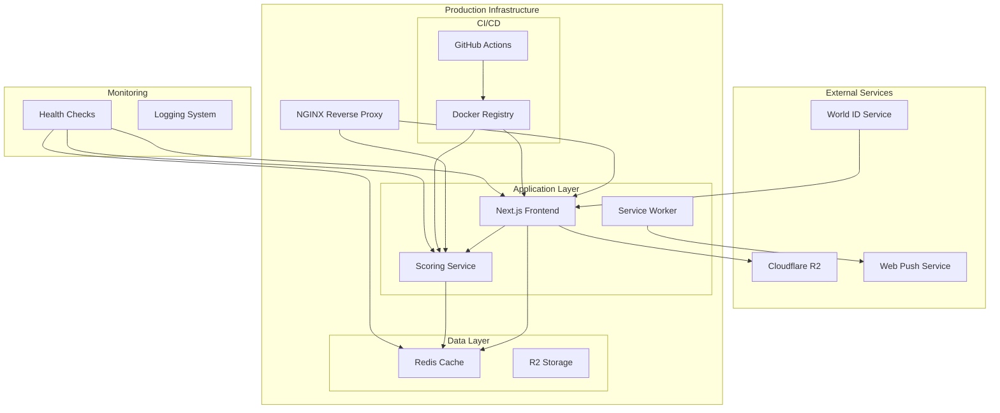

# Design Document

## Overview

The Phase 2 production system transforms the Aurum Circle MVP into a production-ready application with containerized deployment, mock scoring system, and enhanced security. This design maintains all infrastructure hooks for future AI model integration while providing a stable, scalable platform for user testing and feedback.

The system architecture emphasizes separation of concerns, with distinct containers for frontend, scoring service, caching, and optional reverse proxy. The mock scoring system provides realistic user experience while development continues on actual ML models.

## Architecture

### High-Level Architecture



### Container Architecture

The system uses a microservices approach with the following containers:

1. **Frontend Container (Next.js)**: Serves the React application with static optimization
2. **Scoring Service Container**: Handles mock scoring logic and maintains ML service interface
3. **Redis Container**: Provides caching and session storage
4. **NGINX Container**: Reverse proxy and load balancer (optional for production)

### Network Architecture

- **Internal Network**: Docker Compose creates isolated network for service communication
- **External Access**: Only NGINX (port 80/443) and development ports exposed
- **Service Discovery**: Container names used for internal service resolution
- **Health Checks**: Each service exposes `/health` endpoint for monitoring

## Components and Interfaces

### 1. Production World ID Integration

#### World ID SDK Configuration

```typescript
interface WorldIDConfig {
  appId: string;
  action: string;
  signal?: string;
  enableTelemetry: boolean;
  debug: boolean;
}

interface WorldIDProof {
  merkle_root: string;
  nullifier_hash: string;
  proof: string;
  verification_level: string;
}
```

#### Session Management

```typescript
interface UserSession {
  worldId: string;
  nullifierHash: string;
  verificationLevel: "orb" | "device";
  issuedAt: number;
  expiresAt: number;
  nftVerified: boolean;
  profileCompleted: boolean;
}

interface JWTPayload extends UserSession {
  iat: number;
  exp: number;
  iss: string;
}
```

### 2. Mock Scoring System

#### Scoring Service Interface

```typescript
interface ScoreRequest {
  imageData: string; // Base64 encoded
  userId: string;
  sessionId: string;
}

interface ScoreResponse {
  score: number; // 55-95
  breakdown: ScoreBreakdown;
  timestamp: number;
  processingTime: number;
}

interface ScoreBreakdown {
  symmetry: number;
  vibe: number;
  mystique: number;
  overall: number;
  percentile: number;
  mysticTag?: string;
}
```

#### Mock Score Generation Algorithm

```typescript
class MockScoreGenerator {
  generateScore(userId: string, imageHash: string): ScoreResponse {
    // Deterministic random based on user + image
    const seed = this.createSeed(userId, imageHash);
    const baseScore = this.normalDistribution(75, 12, seed);
    const clampedScore = Math.max(55, Math.min(95, baseScore));

    return {
      score: Math.round(clampedScore),
      breakdown: this.generateBreakdown(clampedScore, seed),
      timestamp: Date.now(),
      processingTime: this.randomDelay(500, 2000),
    };
  }
}
```

### 3. BaZi and Mystic Tag System

#### Birth Data Processing

```typescript
interface BirthData {
  date: string; // YYYY-MM-DD
  time: string; // HH:MM
  timezone: string;
}

interface MysticProfile {
  primaryTag: MysticTag;
  secondaryTag?: MysticTag;
  element: "Fire" | "Earth" | "Metal" | "Water" | "Wood";
  compatibility: string[];
}

enum MysticTag {
  PHOENIX = "Phoenix",
  TIGER = "Tiger",
  LOTUS = "Lotus",
  DRAGON = "Dragon",
  CRANE = "Crane",
  WOLF = "Wolf",
  SERPENT = "Serpent",
  EAGLE = "Eagle",
}
```

#### Tag Generation Algorithm

```typescript
class BaZiGenerator {
  generateMysticProfile(birthData: BirthData): MysticProfile {
    const hash = this.hashBirthData(birthData);
    const primaryIndex = hash % Object.keys(MysticTag).length;
    const element = this.calculateElement(birthData);

    return {
      primaryTag: Object.values(MysticTag)[primaryIndex],
      element,
      compatibility: this.calculateCompatibility(primaryIndex, element),
    };
  }
}
```

### 4. PWA and Push Notification System

#### Service Worker Configuration

```typescript
interface PWAConfig {
  name: "Aurum Circle";
  shortName: "Aurum";
  description: "Elite Dating Platform";
  themeColor: "#B3001B";
  backgroundColor: "#0c0c0c";
  display: "standalone";
  orientation: "portrait";
  scope: "/";
  startUrl: "/";
}

interface NotificationSubscription {
  userId: string;
  endpoint: string;
  keys: {
    p256dh: string;
    auth: string;
  };
  createdAt: number;
}
```

#### Push Notification Service

```typescript
class PushNotificationService {
  async sendMatchNotification(
    userId: string,
    matchData: MatchData
  ): Promise<void> {
    const subscription = await this.getSubscription(userId);
    if (!subscription) return;

    const payload = {
      title: "✨ New Match Found!",
      body: "Someone has signaled interest in you",
      icon: "/icons/match-notification.png",
      badge: "/icons/badge.png",
      data: { matchId: matchData.id, type: "match" },
    };

    await webpush.sendNotification(subscription, JSON.stringify(payload));
  }
}
```

### 5. Docker Configuration

#### Frontend Dockerfile

```dockerfile
FROM node:18-alpine AS base
WORKDIR /app
COPY package*.json ./
RUN npm ci --only=production

FROM base AS builder
COPY . .
RUN npm run build

FROM node:18-alpine AS runner
WORKDIR /app
COPY --from=builder /app/.next/standalone ./
COPY --from=builder /app/.next/static ./.next/static
COPY --from=builder /app/public ./public

EXPOSE 3000
CMD ["node", "server.js"]
```

#### Scoring Service Dockerfile

```dockerfile
FROM node:18-alpine
WORKDIR /app
COPY package*.json ./
RUN npm ci --only=production
COPY . .
RUN npm run build

EXPOSE 3001
HEALTHCHECK --interval=30s --timeout=3s --start-period=5s --retries=3 \
  CMD curl -f http://localhost:3001/health || exit 1

CMD ["node", "dist/index.js"]
```

### 6. CI/CD Pipeline Configuration

#### GitHub Actions Workflow

```yaml
name: Deploy Production
on:
  push:
    branches: [main]
  pull_request:
    branches: [main]

jobs:
  test:
    runs-on: ubuntu-latest
    steps:
      - uses: actions/checkout@v4
      - uses: actions/setup-node@v4
        with:
          node-version: "18"
      - run: npm ci
      - run: npm run lint
      - run: npm run test
      - run: npm run build

  deploy-preview:
    if: github.event_name == 'pull_request'
    needs: test
    runs-on: ubuntu-latest
    steps:
      - name: Deploy Preview
        run: |
          docker-compose -f docker-compose.preview.yml up -d
          echo "Preview URL: https://pr-${{ github.event.number }}.aurum.dev"

  deploy-staging:
    if: github.ref == 'refs/heads/main'
    needs: test
    runs-on: ubuntu-latest
    steps:
      - name: Deploy to Staging
        run: |
          docker-compose -f docker-compose.staging.yml up -d
```

## Data Models

### User Profile Schema

```typescript
interface UserProfile {
  id: string;
  worldId: string;
  nullifierHash: string;

  // Profile Information
  handle: string;
  bio?: string;
  profileImage?: string;

  // Verification Status
  worldIdVerified: boolean;
  nftVerified: boolean;
  verificationLevel: "orb" | "device";

  // Mystic Profile
  mysticProfile: MysticProfile;
  birthData: BirthData;

  // Scoring Data
  attractivenessScore?: number;
  scoreBreakdown?: ScoreBreakdown;
  lastScored?: number;

  // Metadata
  createdAt: number;
  updatedAt: number;
  lastActive: number;
}
```

### Session Storage Schema

```typescript
interface SessionData {
  sessionId: string;
  userId: string;
  worldIdProof: WorldIDProof;

  // Authentication State
  isAuthenticated: boolean;
  authenticationSteps: {
    worldId: boolean;
    nftGate: boolean;
    profileSetup: boolean;
  };

  // Temporary Data
  uploadedImages: string[];
  scoringAttempts: number;

  // Expiration
  createdAt: number;
  expiresAt: number;
}
```

### Notification Subscription Schema

```typescript
interface NotificationSubscription {
  id: string;
  userId: string;

  // Push Subscription Data
  endpoint: string;
  keys: {
    p256dh: string;
    auth: string;
  };

  // Preferences
  enabled: boolean;
  types: {
    matches: boolean;
    messages: boolean;
    system: boolean;
  };

  // Metadata
  userAgent: string;
  createdAt: number;
  lastUsed: number;
}
```

## Error Handling

### Error Classification

```typescript
enum ErrorType {
  AUTHENTICATION = "AUTHENTICATION",
  AUTHORIZATION = "AUTHORIZATION",
  VALIDATION = "VALIDATION",
  RATE_LIMIT = "RATE_LIMIT",
  SERVICE_UNAVAILABLE = "SERVICE_UNAVAILABLE",
  INTERNAL_ERROR = "INTERNAL_ERROR",
}

interface APIError {
  type: ErrorType;
  message: string;
  code: string;
  details?: any;
  timestamp: number;
  requestId: string;
}
```

### Error Handling Strategy

1. **Client-Side**: React Error Boundaries with fallback UI
2. **API Routes**: Centralized error middleware with structured responses
3. **Service Layer**: Circuit breaker pattern for external service calls
4. **Logging**: Structured logging with correlation IDs for debugging

### Fallback Mechanisms

- **World ID Failure**: Graceful degradation to device verification
- **Scoring Service Down**: Return cached scores or maintenance message
- **Redis Unavailable**: Fall back to in-memory session storage
- **R2 Storage Issues**: Use local temporary storage with sync retry

## Testing Strategy

### Unit Testing

- **Components**: React Testing Library for UI components
- **Services**: Jest for business logic and API functions
- **Utilities**: Comprehensive coverage for scoring algorithms

### Integration Testing

- **API Endpoints**: Supertest for API route testing
- **Database Operations**: Test database with cleanup between tests
- **External Services**: Mock World ID and Cloudflare services

### End-to-End Testing

- **User Flows**: Playwright for complete user journey testing
- **Cross-Browser**: Chrome, Firefox, Safari compatibility
- **Mobile Testing**: Responsive design and PWA functionality

### Performance Testing

- **Load Testing**: Artillery.js for API endpoint load testing
- **Memory Profiling**: Node.js heap analysis for memory leaks
- **Container Performance**: Resource usage monitoring in Docker

### Security Testing

- **Authentication**: JWT token validation and expiration
- **Authorization**: Access control for protected routes
- **Input Validation**: SQL injection and XSS prevention
- **Rate Limiting**: Abuse prevention testing

## Deployment Architecture

### Environment Configuration

```typescript
interface EnvironmentConfig {
  // World ID Configuration
  NEXT_PUBLIC_WLD_APP_ID: string;
  WLD_APP_SECRET: string;

  // JWT Configuration
  JWT_SECRET: string;
  JWT_EXPIRATION: string; // '24h'

  // Cloudflare R2 Configuration
  CLOUDFLARE_R2_ACCESS_KEY_ID: string;
  CLOUDFLARE_R2_SECRET_ACCESS_KEY: string;
  CLOUDFLARE_R2_BUCKET: string;
  CLOUDFLARE_R2_REGION: string;

  // Redis Configuration
  REDIS_URL: string;
  REDIS_PASSWORD?: string;

  // Application Configuration
  NEXT_PUBLIC_SITE_URL: string;
  NODE_ENV: "development" | "staging" | "production";

  // Push Notification Configuration
  VAPID_PUBLIC_KEY: string;
  VAPID_PRIVATE_KEY: string;
  VAPID_SUBJECT: string;

  // Monitoring Configuration
  LOG_LEVEL: "debug" | "info" | "warn" | "error";
  HEALTH_CHECK_INTERVAL: string; // '30s'
}
```

### Production Deployment Strategy

1. **Blue-Green Deployment**: Zero-downtime deployments with traffic switching
2. **Health Checks**: Kubernetes-style readiness and liveness probes
3. **Auto-scaling**: Container scaling based on CPU and memory metrics
4. **Monitoring**: Comprehensive logging and metrics collection
5. **Backup Strategy**: Automated R2 backup and Redis persistence

### Security Hardening

- **Container Security**: Non-root user, minimal base images
- **Network Security**: Internal network isolation, TLS termination
- **Secrets Management**: Environment variable injection, no hardcoded secrets
- **Access Control**: Role-based access to deployment infrastructure
