# Aurum ML Service Architecture Overview

## Executive Summary

This document outlines the comprehensive architectural migration of the Aurum ML service from a nested, tightly-coupled implementation to a clean, standalone microservice with enhanced capabilities and production-ready features.

## Migration Overview

### Before: Nested Architecture (Legacy)

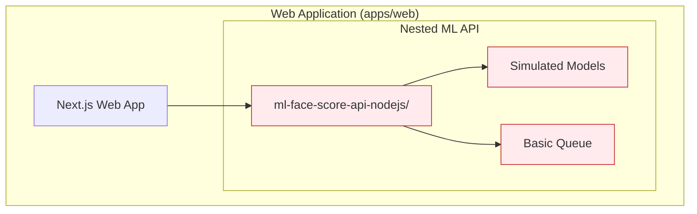

**Issues with Legacy Architecture:**

- **Architectural Boundary Violations**: ML API embedded within web application
- **Limited Scalability**: Tightly coupled to web app lifecycle
- **Basic ML Capabilities**: Only simulated processing
- **Resource Conflicts**: Shared resources with web application
- **Deployment Complexity**: Cannot scale ML processing independently

### After: Standalone Architecture (Current)

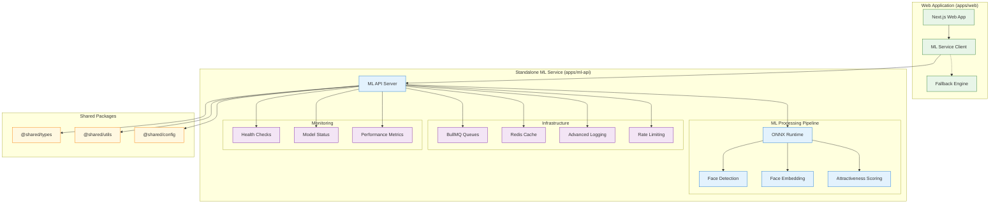

## Key Architectural Benefits

### 1. Separation of Concerns

- **Independent Deployment**: ML service can be deployed and scaled separately
- **Technology Focus**: Each service optimized for its specific purpose
- **Resource Isolation**: Dedicated resources for ML processing
- **Fault Isolation**: ML service failures don't affect web application

### 2. Enhanced ML Capabilities

- **Real ONNX Models**: Production-grade face detection and embedding extraction
- **Batch Processing**: Process multiple images in parallel
- **Quality Validation**: Comprehensive face quality metrics
- **Fallback Mechanisms**: Graceful degradation when models unavailable

### 3. Production-Ready Infrastructure

- **Advanced Queuing**: BullMQ with monitoring and retry logic
- **Caching Layer**: Redis for high-performance data access
- **Comprehensive Monitoring**: Health checks, metrics, and observability
- **Security Features**: Rate limiting, input validation, and CORS

### 4. Monorepo Integration

- **Shared Types**: Consistent interfaces across services
- **Shared Utilities**: Standardized error handling and logging
- **Configuration Management**: Centralized config patterns

## Service Communication Patterns

### 1. Synchronous Processing

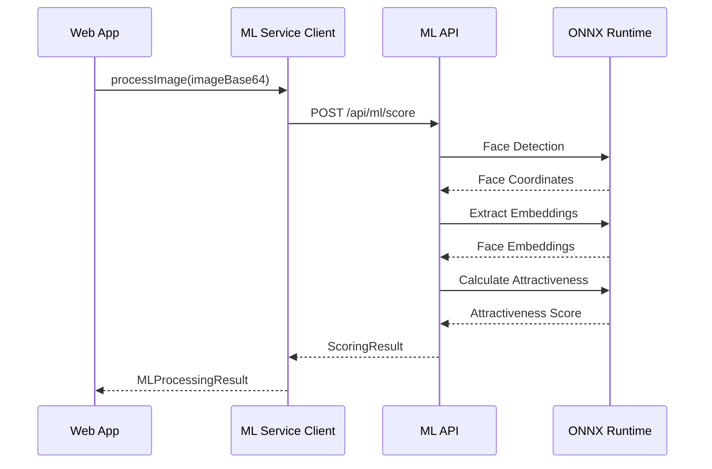

### 2. Fallback Handling

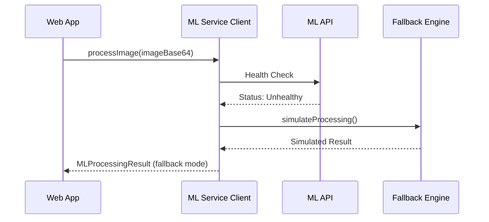

### 3. Batch Processing

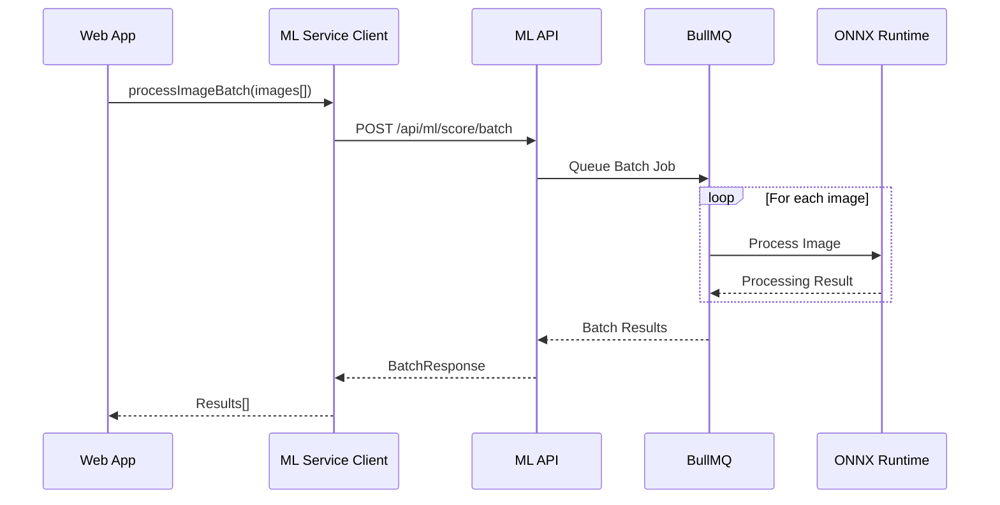

## Data Flow Architecture

### Input Processing Pipeline

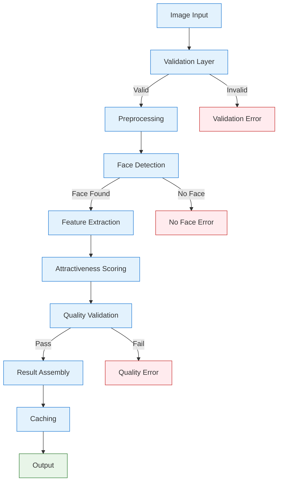

### Error Handling Strategy

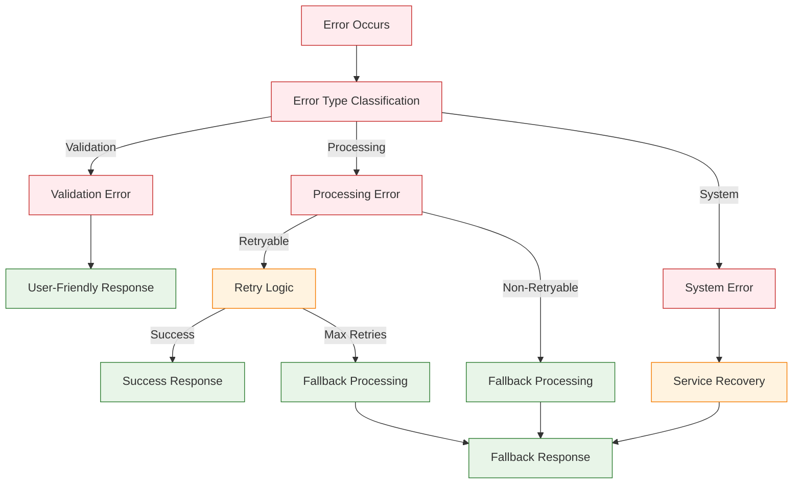

## Performance Architecture

### Caching Strategy

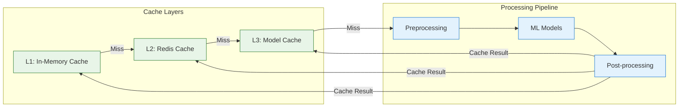

### Scalability Architecture

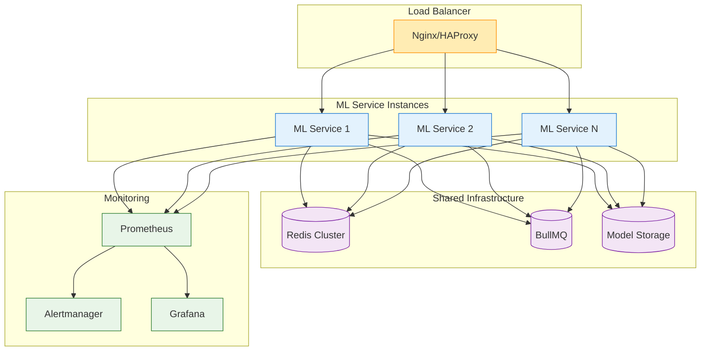

## Security Architecture

### Defense in Depth Strategy

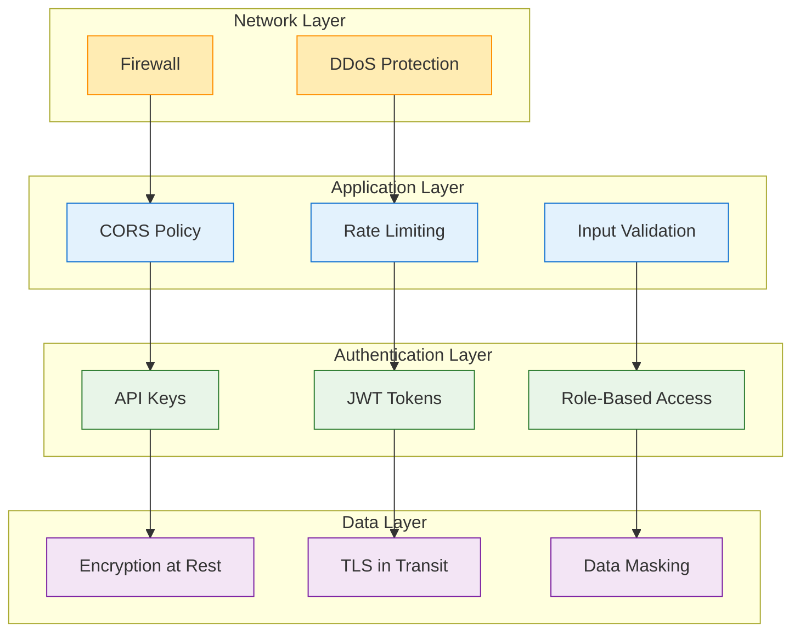

## Deployment Architecture

### Container Orchestration

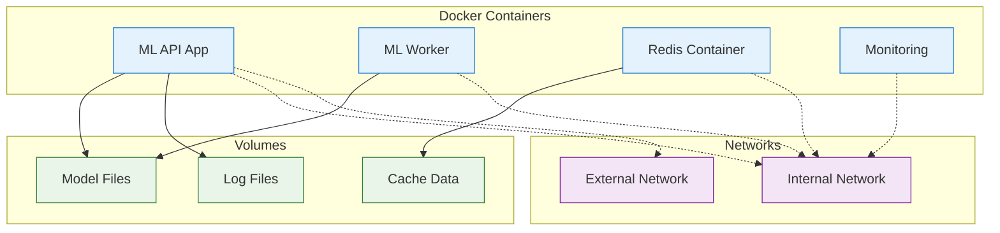

## Monitoring and Observability

### Observability Stack

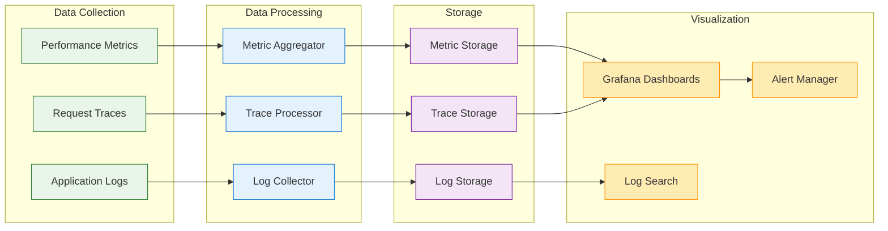

## Future Architecture Considerations

### Planned Enhancements

1. **GPU Acceleration**
   - CUDA-enabled containers for faster model inference
   - Dynamic GPU resource allocation
   - Cost optimization through GPU sharing

2. **Model Management**
   - Model versioning and rollback capabilities
   - A/B testing infrastructure for model comparison
   - Automated model deployment pipelines

3. **Advanced Analytics**
   - Real-time performance analytics
   - Predictive scaling based on usage patterns
   - ML model drift detection

4. **Global Distribution**
   - Multi-region deployment strategy
   - Edge computing for reduced latency
   - Content delivery network integration

### Scalability Targets

- **Throughput**: 10,000+ requests per minute
- **Latency**: Sub-200ms average response time
- **Availability**: 99.9% uptime with graceful degradation
- **Scalability**: Auto-scaling from 1 to 100+ instances

## Conclusion

The migration from nested to standalone ML service architecture represents a significant improvement in:

- **Architectural Cleanliness**: Clear separation of concerns
- **Scalability**: Independent scaling and resource management
- **Reliability**: Robust error handling and fallback mechanisms
- **Performance**: Optimized processing pipeline with caching
- **Maintainability**: Modular design with shared components
- **Observability**: Comprehensive monitoring and alerting

This foundation supports future enhancements and ensures the ML service can scale to meet growing demands while maintaining high quality and reliability standards.
