# Aurum Circle Enhanced Architecture Diagram

## System Architecture Overview

```mermaid
graph TB
    subgraph "Client Layer (Next.js)"
        A[Next.js App]
        B[World App Browser]
        C[Mobile Devices]

        A --> D[Authentication Flow]
        A --> E[Profile Management]
        A --> F[Vault Dashboard]
        A --> G[Invite System]
        A --> H[Signal Matching]
        A --> I[Event Tickets]
        A --> J[AI Scoring]
    end

    subgraph "API Layer"
        K[API Gateway]

        K --> L[Auth Endpoints]
        K --> M[Profile Endpoints]
        K --> N[Storage Endpoints]
        K --> O[Invite Endpoints]
        K --> P[Signal Endpoints]
        K --> Q[Event Endpoints]
        K --> R[ML Endpoints]
        K --> S[Discovery Endpoints]
    end

    subgraph "Business Logic Layer"
        T[Services]

        T --> U[Profile Service]
        T --> V[Invite Service]
        T --> W[Signal Service]
        T --> X[Event Service]
        T --> Y[Discovery Service]
        T --> Z[Scoring Service]
    end

    subgraph "Data Layer"
        AA[Primary Storage]
        BB[Cache Layer]
        CC[Vector Store]
        DD[Queue System]

        AA --> EE[Cloudflare R2]
        BB --> FF[Redis]
        CC --> GG[Qdrant]
        DD --> HH[BullMQ]
    end

    subgraph "External Services"
        II[World ID API]
        JJ[Blockchain API]
        KK[ML Services]
        LL[CDN]

        II --> AAA[MiniKit SDK]
        JJ --> BBB[Wallet Connect]
        JJ --> CCC[NFT Verification]
        KK --> DDD[Rust ML]
        LL --> EEE[Image CDN]
    end

    %% Connections
    A --> K
    B --> A
    C --> A

    K --> T
    T --> AA
    T --> BB
    T --> CC
    T --> DD

    AA --> II
    AA --> JJ
    BB --> FF
    CC --> GG
    DD --> HH

    AA --> LL
    AA --> KK

    style A fill:#e1f5fe
    style K fill:#f3e5f5
    style T fill:#e8f5e8
    style AA fill:#fff3e0
    style II fill:#fce4ec
```

## Data Flow Architecture

### 1. User Authentication Flow

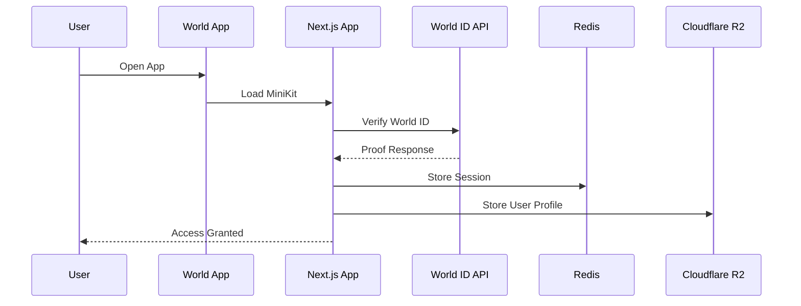

### 2. Profile Management Flow

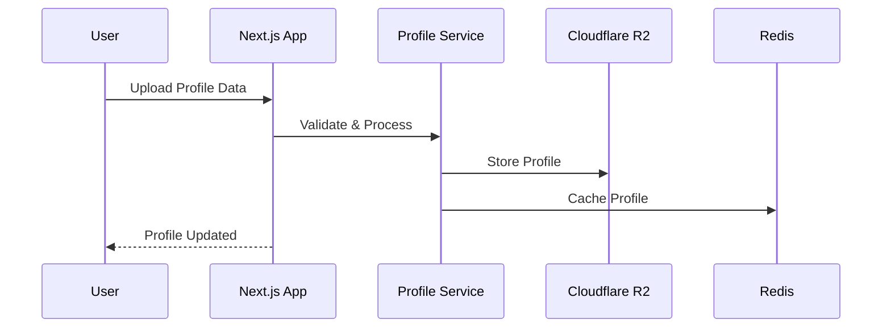

### 3. Invite System Flow

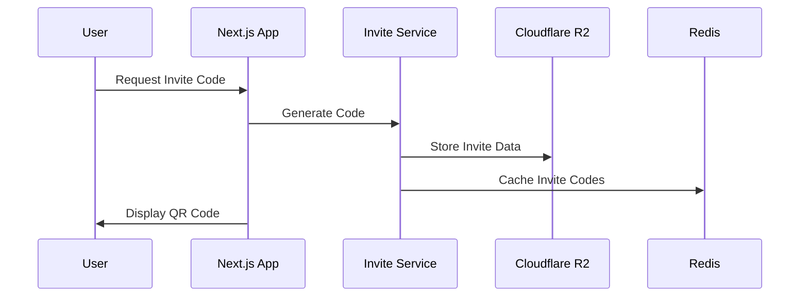

### 4. Signal Matching Flow

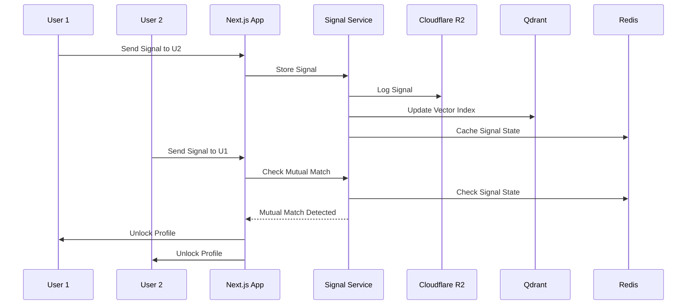

### 5. Event Ticket Flow

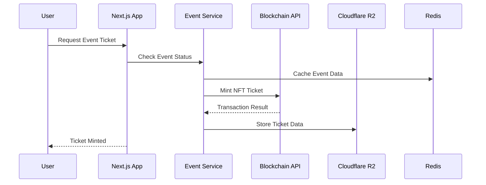

## Component Architecture

### Frontend Components

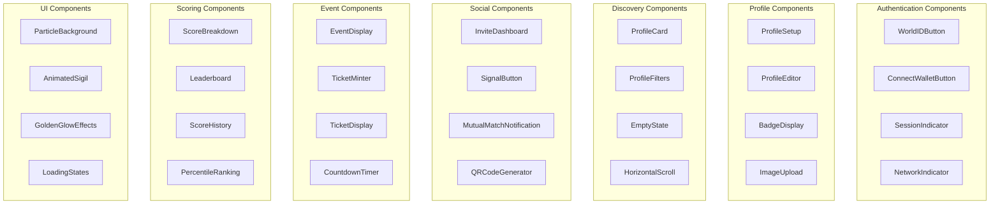

### Backend Services

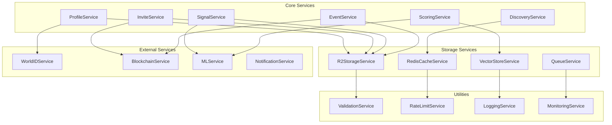

## Database Schema

### User Profile Schema

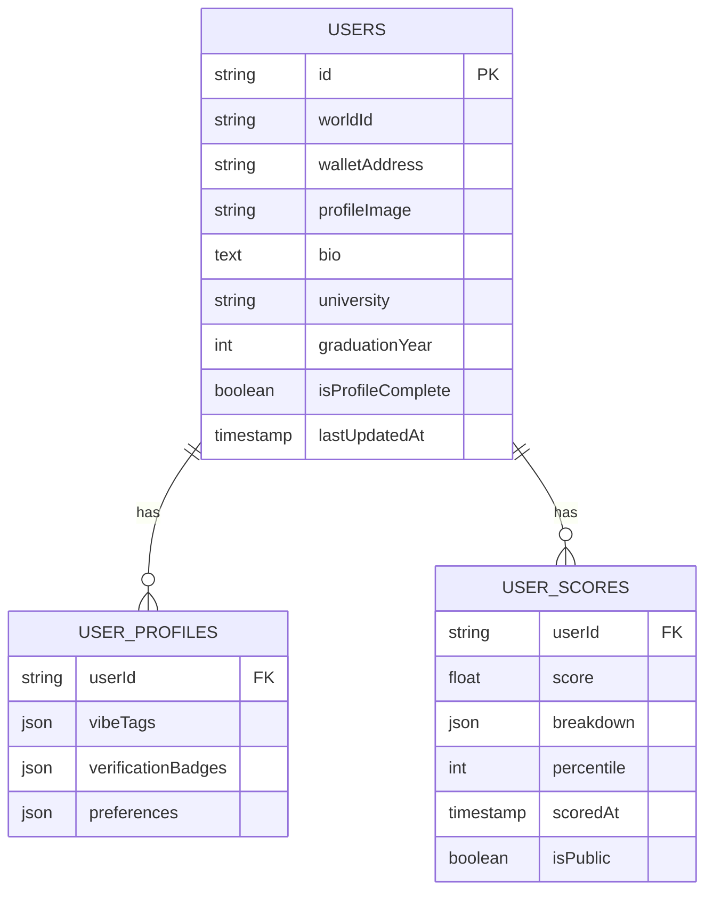

### Invite System Schema

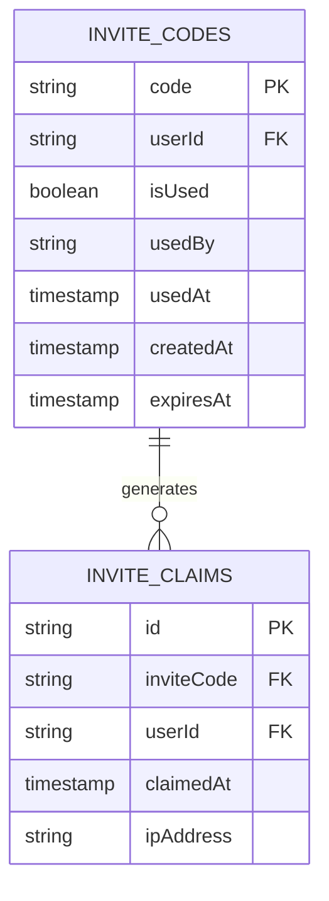

### Signal System Schema

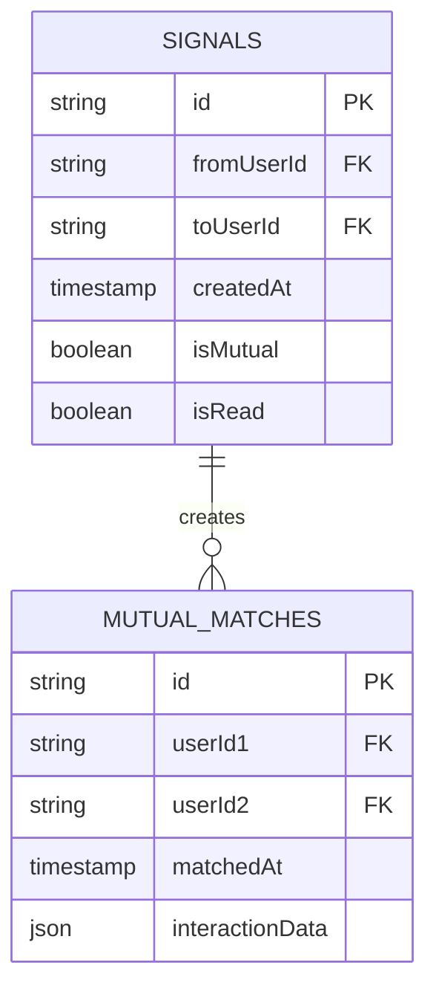

### Event System Schema

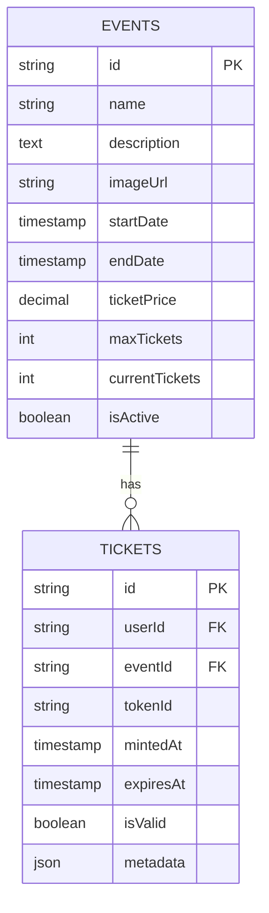

## API Architecture

### RESTful API Structure

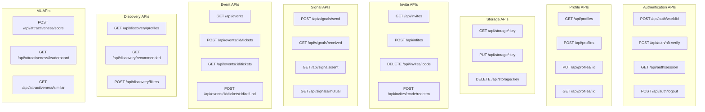

## Security Architecture

### Authentication & Authorization

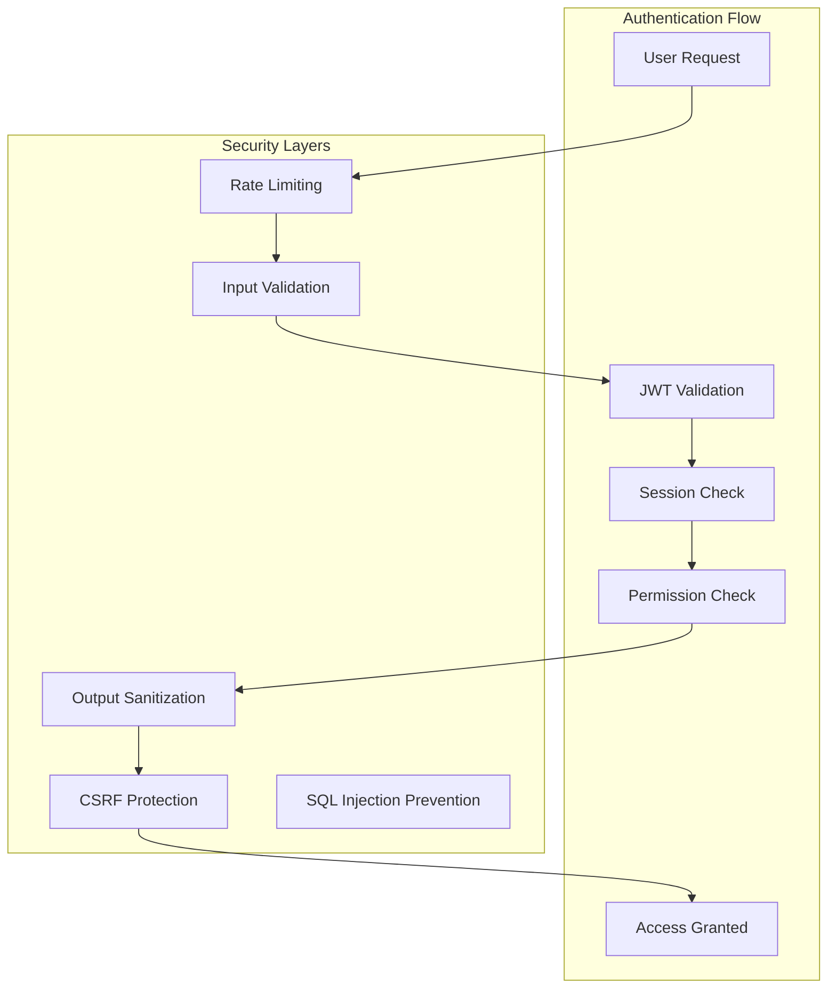

### Data Protection

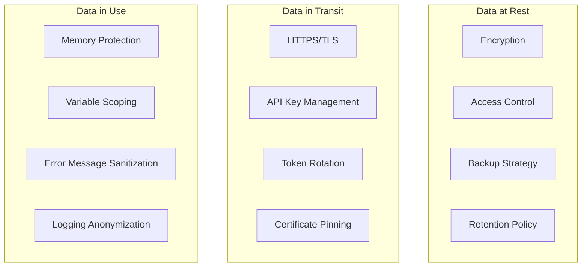

## Performance Architecture

### Caching Strategy

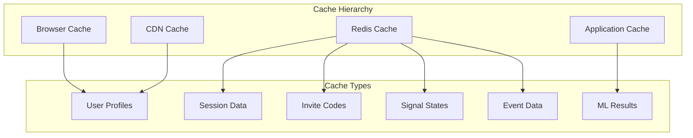

### Load Balancing

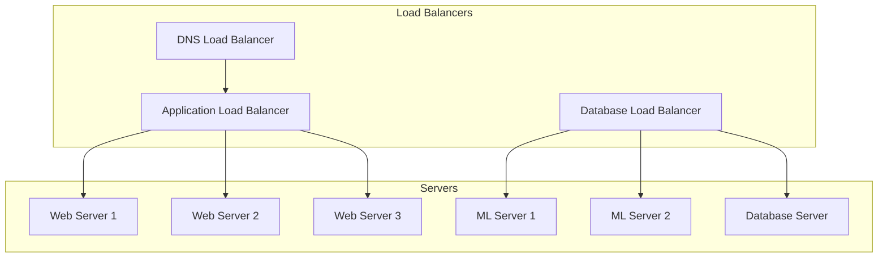

## Monitoring & Observability

### Logging Architecture

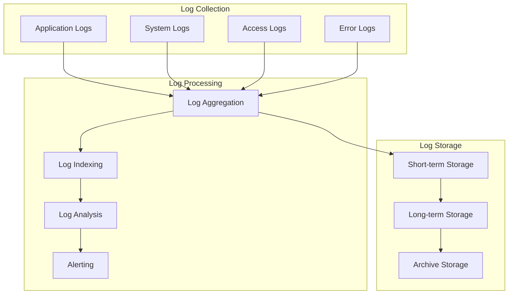

### Metrics Architecture

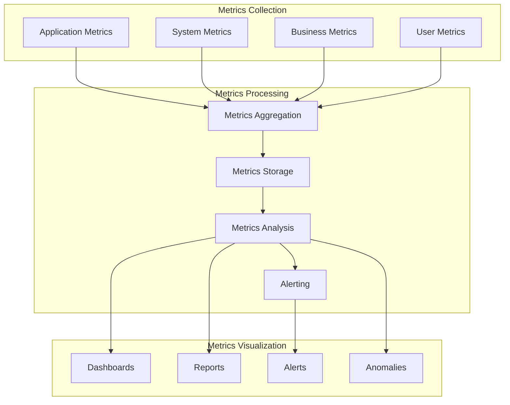

This comprehensive architecture diagram provides a complete view of the enhanced Aurum Circle system, showing how all components interact and data flows through the system. The architecture is designed to be scalable, secure, and performant while maintaining the exclusive, secret society theme of the platform.
