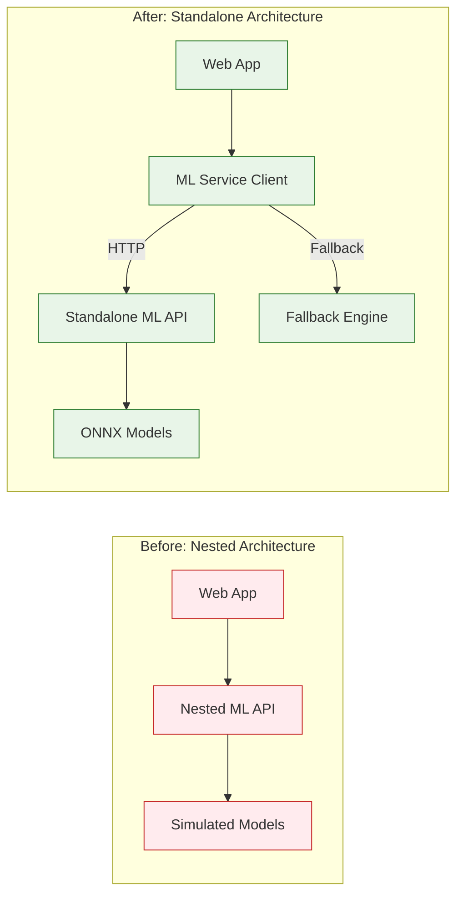
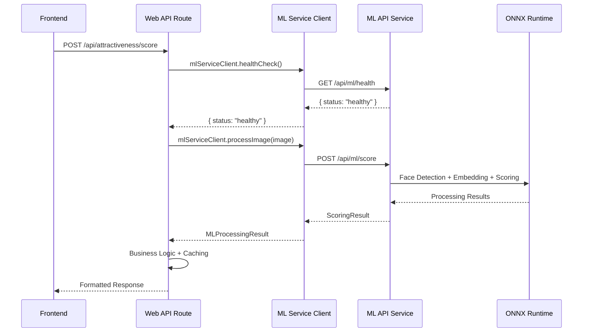
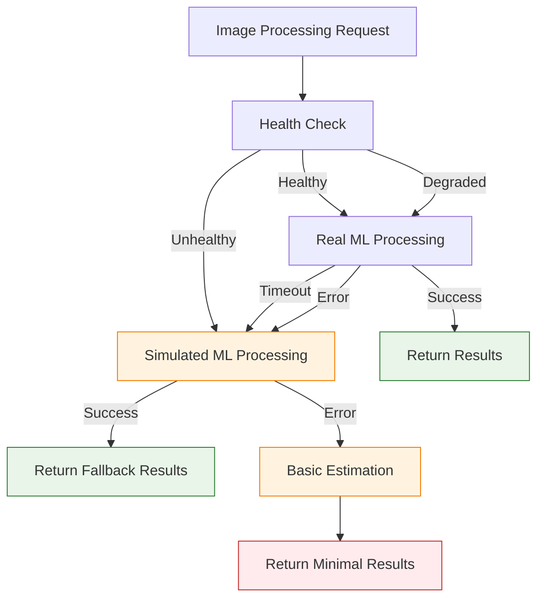

# ML Service Integration Guide

This guide explains how the Aurum web application integrates with the standalone ML API service, including communication patterns, fallback mechanisms, and best practices for development and production deployment.

## Table of Contents

1. [Integration Overview](#integration-overview)
2. [ML Service Client](#ml-service-client)
3. [Communication Patterns](#communication-patterns)
4. [Fallback Mechanisms](#fallback-mechanisms)
5. [Configuration](#configuration)
6. [Error Handling](#error-handling)
7. [Development Workflow](#development-workflow)
8. [Testing Strategies](#testing-strategies)
9. [Migration Guide](#migration-guide)
10. [Performance Optimization](#performance-optimization)
11. [Troubleshooting](#troubleshooting)

## Integration Overview

### Before and After Architecture



### Key Integration Points

1. **ML Service Client** (`apps/web/src/lib/ml-service-client.ts`)
   - HTTP client for communicating with standalone ML API
   - Handles authentication, retries, and error recovery
   - Provides fallback to simulated processing

2. **Web App API Routes** (`apps/web/src/app/api/attractiveness/`)
   - Bridges frontend requests to ML service
   - Implements business logic and user validation
   - Manages caching and response formatting

3. **Shared Types** (`@shared/types`)
   - Consistent interfaces between services
   - Type safety for ML processing results
   - API response standardization

## ML Service Client

### Client Architecture

```typescript
// apps/web/src/lib/ml-service-client.ts

/**
 * @description ML Service Client for communicating with standalone ML API
 * Replaces direct browser-based ML processing with server-side processing
 */
export class MLServiceClient {
  private config: MLServiceConfig;

  constructor(config?: Partial<MLServiceConfig>) {
    this.config = {
      baseUrl: process.env.ML_API_URL || 'http://localhost:3003',
      timeout: 30000,
      retries: 3,
      ...config,
    };
  }

  // Health checking
  async healthCheck(): Promise<HealthStatus>;

  // Single image processing
  async processImage(imageBase64: string): Promise<MLProcessingResult | null>;

  // Batch processing
  async processImageBatch(
    images: string[]
  ): Promise<Array<MLProcessingResult | null>>;

  // Result validation
  validateResult(result: MLProcessingResult): MLValidationResult;
}
```

### Configuration Options

```typescript
interface MLServiceConfig {
  baseUrl: string; // ML API service URL
  timeout: number; // Request timeout in milliseconds
  retries: number; // Number of retry attempts
}

// Environment variables
const config = {
  baseUrl: process.env.ML_API_URL || 'http://localhost:3003',
  timeout: parseInt(process.env.ML_API_TIMEOUT) || 30000,
  retries: parseInt(process.env.ML_API_RETRIES) || 3,
};
```

### Usage Examples

#### Basic Image Processing

```typescript
import { mlServiceClient } from '@/lib/ml-service-client';

async function processUserImage(imageBase64: string) {
  try {
    // Check service health first
    const health = await mlServiceClient.healthCheck();

    if (health.status === 'unhealthy') {
      console.warn('ML service unhealthy, using fallback');
      // Handle fallback scenario
    }

    // Process the image
    const result = await mlServiceClient.processImage(imageBase64);

    if (!result) {
      throw new Error('No face detected in image');
    }

    // Validate result quality
    const validation = mlServiceClient.validateResult(result);

    if (!validation.isValid) {
      throw new Error(`Face quality insufficient: ${validation.reason}`);
    }

    return result;
  } catch (error) {
    console.error('ML processing failed:', error);
    throw error;
  }
}
```

#### Batch Processing

```typescript
async function processBatchImages(imageArray: string[]) {
  try {
    const results = await mlServiceClient.processImageBatch(imageArray);

    // Filter successful results
    const successfulResults = results.filter(result => result !== null);
    const failedCount = results.length - successfulResults.length;

    console.log(
      `Processed ${successfulResults.length}/${results.length} images successfully`
    );

    return {
      successful: successfulResults,
      failedCount,
      successRate: successfulResults.length / results.length,
    };
  } catch (error) {
    console.error('Batch processing failed:', error);
    throw error;
  }
}
```

## Communication Patterns

### Synchronous Processing Flow



### Health Check Pattern

```typescript
// Proactive health checking before processing
async function processWithHealthCheck(imageBase64: string) {
  const health = await mlServiceClient.healthCheck();

  switch (health.status) {
    case 'healthy':
      return await mlServiceClient.processImage(imageBase64);

    case 'degraded':
      console.warn(`ML service degraded (latency: ${health.latency}ms)`);
      // Continue with processing but monitor performance
      return await mlServiceClient.processImage(imageBase64);

    case 'unhealthy':
      console.error('ML service unhealthy, using fallback');
      throw new Error('ML service unavailable');
  }
}
```

### Request/Response Format

#### Request Format (Web App → ML Service)

```http
POST /api/ml/score HTTP/1.1
Content-Type: multipart/form-data

image: [Binary image data]
userId: "user-123"
sessionId: "session-abc"
```

#### Response Format (ML Service → Web App)

```json
{
  "status": "success",
  "message": "Face score calculated successfully using advanced ONNX models",
  "data": {
    "score": 0.87,
    "percentile": 87.5,
    "vibeTags": ["stunning", "attractive"],
    "timestamp": "2025-08-11T09:30:00.000Z",
    "metadata": {
      "faceQuality": 0.92,
      "frontality": 0.89,
      "symmetry": 0.85,
      "resolution": 0.95,
      "confidence": 0.91
    },
    "processingTime": 245,
    "faceDetected": true,
    "faceCount": 1,
    "embeddings": [0.1234, -0.5678, ...]
  }
}
```

## Fallback Mechanisms

### Multi-Level Fallback Strategy



### Implementation Example

```typescript
// apps/web/src/app/api/attractiveness/score/route.ts

export async function POST(request: NextRequest) {
  let actualEngine = useRealML
    ? attractivenessEngine
    : attractivenessEngineSimulated;
  let actualMLMode = useRealML ? 'production_ml' : 'simulated_ml';
  let fallbackUsed = false;

  if (useRealML) {
    try {
      const healthCheck = await mlServiceClient.healthCheck();
      if (healthCheck.status === 'unhealthy') {
        console.warn(
          'Real ML models unavailable, falling back to simulated mode'
        );
        actualEngine = attractivenessEngineSimulated;
        actualMLMode = 'simulated_fallback';
        fallbackUsed = true;
      }
    } catch (error) {
      console.warn(
        'ML health check failed, falling back to simulated mode:',
        error
      );
      actualEngine = attractivenessEngineSimulated;
      actualMLMode = 'simulated_fallback';
      fallbackUsed = true;
    }
  }

  // Process with chosen engine
  const result = await actualEngine.scoreUser(scoringRequest);

  return NextResponse.json({
    success: true,
    data: result,
    message: fallbackUsed
      ? `Scored successfully (fallback mode)! Rank #${result.metadata.userRank}`
      : `Scored successfully! Rank #${result.metadata.userRank}`,
    debug: {
      mlMode: actualMLMode,
      fallbackUsed,
      processingPipeline:
        actualMLMode === 'production_ml'
          ? 'real_ml_detection -> arcface_embedding -> vector_comparison'
          : 'simulated_detection -> simulated_embedding -> vector_comparison',
    },
  });
}
```

## Configuration

### Environment Variables

#### Web Application (`apps/web/.env.local`)

```bash
# ML Service Configuration
ML_API_URL=http://localhost:3003
ML_API_TIMEOUT=30000
ML_API_RETRIES=3

# Feature Flags
USE_REAL_ML=true
FALLBACK_TO_SIMULATED=true

# Cache Configuration
REDIS_URL=redis://localhost:6379
ML_CACHE_TTL=3600

# Monitoring
ENABLE_ML_METRICS=true
LOG_ML_REQUESTS=true
```

#### ML API Service (`apps/ml-api/.env`)

```bash
# Server Configuration
PORT=3003
HOST=0.0.0.0
NODE_ENV=production

# Model Configuration
MODEL_PATH=./models
FACE_DETECTION_MODEL=face_detection.onnx
FACE_EMBEDDING_MODEL=face_embedding.onnx
ATTRACTIVENESS_MODEL=attractiveness_model.onnx

# Processing Configuration
ML_BATCH_SIZE=10
ML_TIMEOUT=30000
ML_MAX_RETRIES=3

# Redis Configuration (shared with web app)
REDIS_URL=redis://localhost:6379
BULLMQ_QUEUE_NAME=ml-scoring
BULLMQ_CONCURRENCY=5
```

## Error Handling

### Error Types and Responses

```typescript
// Standardized error types
export type MLServiceError =
  | 'SERVICE_UNAVAILABLE'
  | 'PROCESSING_TIMEOUT'
  | 'INVALID_IMAGE'
  | 'NO_FACE_DETECTED'
  | 'FACE_QUALITY_LOW'
  | 'QUOTA_EXCEEDED'
  | 'AUTHENTICATION_FAILED';

// Error handling in web app
async function handleMLProcessing(imageBase64: string): Promise<ScoringResult> {
  try {
    return await mlServiceClient.processImage(imageBase64);
  } catch (error: any) {
    // Map ML service errors to user-friendly messages
    switch (error.type) {
      case 'SERVICE_UNAVAILABLE':
        throw new ProcessingError(
          'ML service is temporarily unavailable. Please try again later.'
        );

      case 'NO_FACE_DETECTED':
        throw new ValidationError(
          'No face detected in the image. Please upload a clear portrait photo.'
        );

      case 'FACE_QUALITY_LOW':
        throw new ValidationError(
          'Face quality is too low for accurate scoring. Please ensure good lighting and clear resolution.'
        );

      case 'PROCESSING_TIMEOUT':
        throw new ProcessingError(
          'Image processing timed out. Please try again with a smaller image.'
        );

      case 'INVALID_IMAGE':
        throw new ValidationError(
          'Invalid image format. Please upload a JPEG, PNG, or WebP image.'
        );

      default:
        throw new ProcessingError(
          'An unexpected error occurred during image processing.'
        );
    }
  }
}
```

## Development Workflow

### Local Development Setup

```bash
# 1. Start Redis
redis-server

# 2. Start ML API service
cd apps/ml-api
npm install
npm run dev

# 3. Start web application
cd apps/web
npm install
npm run dev

# 4. Verify integration
curl http://localhost:3000/api/attractiveness/ml-status
```

### Testing ML Service Integration

```typescript
// Integration test example
describe('ML Service Integration', () => {
  it('should process image successfully', async () => {
    const testImage = 'data:image/jpeg;base64,/9j/4AAQSkZJRgABAQEA...';

    const response = await fetch('/api/attractiveness/score', {
      method: 'POST',
      headers: { 'Content-Type': 'application/json' },
      body: JSON.stringify({
        userId: 'test-user',
        image: testImage,
        useRealML: true,
      }),
    });

    expect(response.status).toBe(200);

    const data = await response.json();
    expect(data.success).toBe(true);
    expect(data.data.score).toBeGreaterThan(0);
    expect(data.data.faceDetected).toBe(true);
  });

  it('should fallback gracefully when ML service unavailable', async () => {
    // Mock ML service to be unavailable
    jest
      .spyOn(mlServiceClient, 'healthCheck')
      .mockResolvedValue({ status: 'unhealthy' });

    const testImage = 'data:image/jpeg;base64,/9j/4AAQSkZJRgABAQEA...';

    const response = await fetch('/api/attractiveness/score', {
      method: 'POST',
      headers: { 'Content-Type': 'application/json' },
      body: JSON.stringify({
        userId: 'test-user',
        image: testImage,
        useRealML: true,
      }),
    });

    expect(response.status).toBe(200);

    const data = await response.json();
    expect(data.success).toBe(true);
    expect(data.debug.fallbackUsed).toBe(true);
    expect(data.debug.mlMode).toBe('simulated_fallback');
  });
});
```

## Migration Guide

### Migrating from Nested API

#### Step 1: Update Dependencies

```bash
# Remove old nested ML dependencies
npm uninstall @tensorflow/tfjs @tensorflow/tfjs-node

# Add ML service client dependencies
npm install @shared/types @shared/utils
```

#### Step 2: Replace ML Model Integration

```typescript
// Before: Direct model import
// import { mlModelIntegration } from '@/lib/ml-models/model-integration';

// After: ML service client
import { mlServiceClient } from '@/lib/ml-service-client';

// Update processing calls
const result = await mlServiceClient.processImage(imageBase64);
```

#### Step 3: Update API Routes

```typescript
// Before: Direct model processing
app.post('/api/score', async (req, res) => {
  const result = await mlModelIntegration.processImage(req.body.image);
  res.json({ success: true, data: result });
});

// After: ML service with fallback
app.post('/api/score', async (req, res) => {
  try {
    const health = await mlServiceClient.healthCheck();
    if (health.status === 'unhealthy') {
      // Use fallback engine
      const result = await fallbackEngine.processImage(req.body.image);
      return res.json({
        success: true,
        data: result,
        fallbackUsed: true,
      });
    }

    const result = await mlServiceClient.processImage(req.body.image);
    res.json({ success: true, data: result });
  } catch (error) {
    res.status(500).json({ success: false, error: error.message });
  }
});
```

## Performance Optimization

### Caching Strategies

```typescript
// Result caching with Redis
class MLResultCache {
  private redis: Redis;
  private ttl: number = 3600; // 1 hour

  async get(imageHash: string): Promise<MLProcessingResult | null> {
    const cached = await this.redis.get(`ml:result:${imageHash}`);
    return cached ? JSON.parse(cached) : null;
  }

  async set(imageHash: string, result: MLProcessingResult): Promise<void> {
    await this.redis.setex(
      `ml:result:${imageHash}`,
      this.ttl,
      JSON.stringify(result)
    );
  }

  // Generate consistent hash for images
  generateImageHash(imageBase64: string): string {
    return crypto.createHash('sha256').update(imageBase64).digest('hex');
  }
}

// Usage in API route
const imageHash = mlCache.generateImageHash(imageBase64);
let result = await mlCache.get(imageHash);

if (!result) {
  result = await mlServiceClient.processImage(imageBase64);
  await mlCache.set(imageHash, result);
}
```

### Request Batching

```typescript
// Batch multiple requests to reduce overhead
class MLRequestBatcher {
  private batch: Array<{
    imageBase64: string;
    resolve: (result: MLProcessingResult) => void;
    reject: (error: Error) => void;
  }> = [];
  private batchTimeout: NodeJS.Timeout | null = null;
  private readonly batchSize = 5;
  private readonly batchDelay = 100; // 100ms

  async processImage(imageBase64: string): Promise<MLProcessingResult> {
    return new Promise((resolve, reject) => {
      this.batch.push({ imageBase64, resolve, reject });

      if (this.batch.length >= this.batchSize) {
        this.processBatch();
      } else if (!this.batchTimeout) {
        this.batchTimeout = setTimeout(
          () => this.processBatch(),
          this.batchDelay
        );
      }
    });
  }

  private async processBatch(): Promise<void> {
    if (this.batchTimeout) {
      clearTimeout(this.batchTimeout);
      this.batchTimeout = null;
    }

    const currentBatch = this.batch.splice(0);
    if (currentBatch.length === 0) return;

    try {
      const images = currentBatch.map(item => item.imageBase64);
      const results = await mlServiceClient.processImageBatch(images);

      currentBatch.forEach((item, index) => {
        const result = results[index];
        if (result) {
          item.resolve(result);
        } else {
          item.reject(new Error('Processing failed'));
        }
      });
    } catch (error) {
      currentBatch.forEach(item => item.reject(error as Error));
    }
  }
}
```

## Troubleshooting

### Common Issues

#### 1. ML Service Connection Failed

**Symptoms:**

- `ECONNREFUSED` errors in logs
- Health check failures
- Fallback mode always activated

**Solutions:**

```bash
# Check if ML service is running
curl http://localhost:3003/health

# Verify environment configuration
echo $ML_API_URL

# Check Docker network connectivity
docker network ls
docker network inspect <network-name>
```

#### 2. High Latency Issues

**Symptoms:**

- Processing times > 10 seconds
- Timeout errors
- Poor user experience

**Solutions:**

```typescript
// Monitor processing times
console.time('ml-processing');
const result = await mlServiceClient.processImage(imageBase64);
console.timeEnd('ml-processing');

// Implement timeout warnings
const PROCESSING_WARNING_THRESHOLD = 5000; // 5 seconds

const processingTimer = setTimeout(() => {
  console.warn('ML processing taking longer than expected');
}, PROCESSING_WARNING_THRESHOLD);

try {
  const result = await mlServiceClient.processImage(imageBase64);
  clearTimeout(processingTimer);
  return result;
} catch (error) {
  clearTimeout(processingTimer);
  throw error;
}
```

#### 3. Memory Leaks

**Symptoms:**

- Increasing memory usage over time
- Out of memory errors
- Performance degradation

**Solutions:**

```typescript
// Monitor memory usage
setInterval(() => {
  const memUsage = process.memoryUsage();
  console.log('Memory usage:', {
    rss: Math.round(memUsage.rss / 1024 / 1024) + 'MB',
    heapTotal: Math.round(memUsage.heapTotal / 1024 / 1024) + 'MB',
    heapUsed: Math.round(memUsage.heapUsed / 1024 / 1024) + 'MB',
  });
}, 30000); // Every 30 seconds

// Implement connection pooling
const agent = new http.Agent({
  keepAlive: true,
  maxSockets: 10,
  maxFreeSockets: 5,
});
```

### Debugging Commands

```bash
# Check ML service logs
docker logs ml-api-container

# Monitor Redis connections
redis-cli monitor

# Test ML service endpoints
curl -X POST http://localhost:3003/api/ml/score \
  -F "image=@test-image.jpg" \
  -F "userId=debug-user"

# Check queue status
curl http://localhost:3003/api/ml/models/status | jq '.data.queue'
```

### Performance Monitoring

```typescript
// Add performance monitoring to ML service client
class PerformanceMonitor {
  private metrics: Map<string, number[]> = new Map();

  recordLatency(operation: string, latency: number): void {
    if (!this.metrics.has(operation)) {
      this.metrics.set(operation, []);
    }

    const operationMetrics = this.metrics.get(operation)!;
    operationMetrics.push(latency);

    // Keep only last 100 measurements
    if (operationMetrics.length > 100) {
      operationMetrics.shift();
    }
  }

  getStats(
    operation: string
  ): { avg: number; p95: number; p99: number } | null {
    const measurements = this.metrics.get(operation);
    if (!measurements || measurements.length === 0) return null;

    const sorted = [...measurements].sort((a, b) => a - b);
    const avg =
      measurements.reduce((sum, val) => sum + val, 0) / measurements.length;
    const p95 = sorted[Math.floor(sorted.length * 0.95)];
    const p99 = sorted[Math.floor(sorted.length * 0.99)];

    return { avg, p95, p99 };
  }
}

const performanceMonitor = new PerformanceMonitor();

// Wrap ML service calls with monitoring
async function monitoredProcessImage(
  imageBase64: string
): Promise<MLProcessingResult> {
  const startTime = Date.now();

  try {
    const result = await mlServiceClient.processImage(imageBase64);
    const latency = Date.now() - startTime;
    performanceMonitor.recordLatency('processImage', latency);
    return result;
  } catch (error) {
    const latency = Date.now() - startTime;
    performanceMonitor.recordLatency('processImageError', latency);
    throw error;
  }
}
```

---

## Summary

This integration guide provides comprehensive information for working with the Aurum ML service architecture. Key takeaways:

1. **Clean Separation**: Web app and ML service are properly decoupled
2. **Robust Fallbacks**: Multiple levels of fallback ensure service availability
3. **Performance Focus**: Caching, batching, and monitoring optimize performance
4. **Developer Experience**: Clear APIs, comprehensive testing, and debugging tools
5. **Production Ready**: Error handling, monitoring, and scaling considerations

For additional help, refer to:

- [ML API Documentation](apps/ml-api/README.md)
- [Architecture Overview](ARCHITECTURE.md)
- [Troubleshooting Guide](TROUBLESHOOTING.md)
- [Deployment Guide](apps/ml-api/DEPLOYMENT.md)
