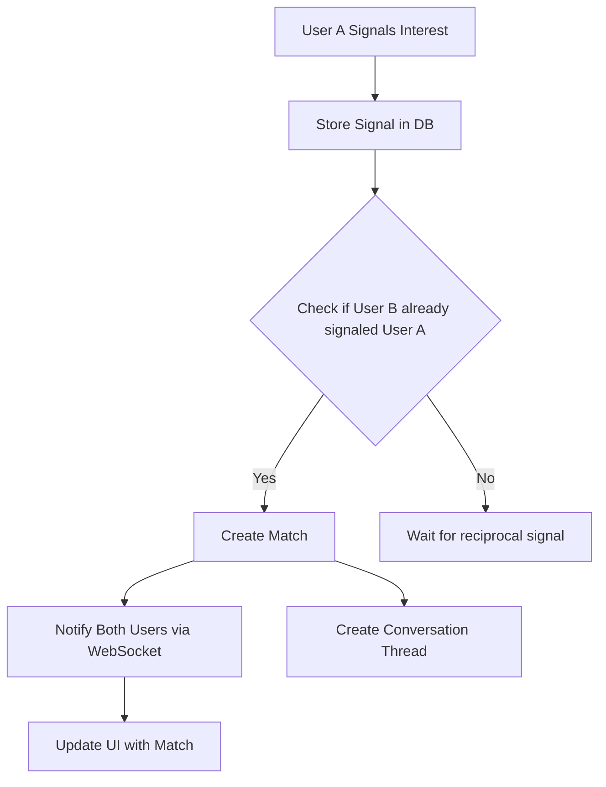
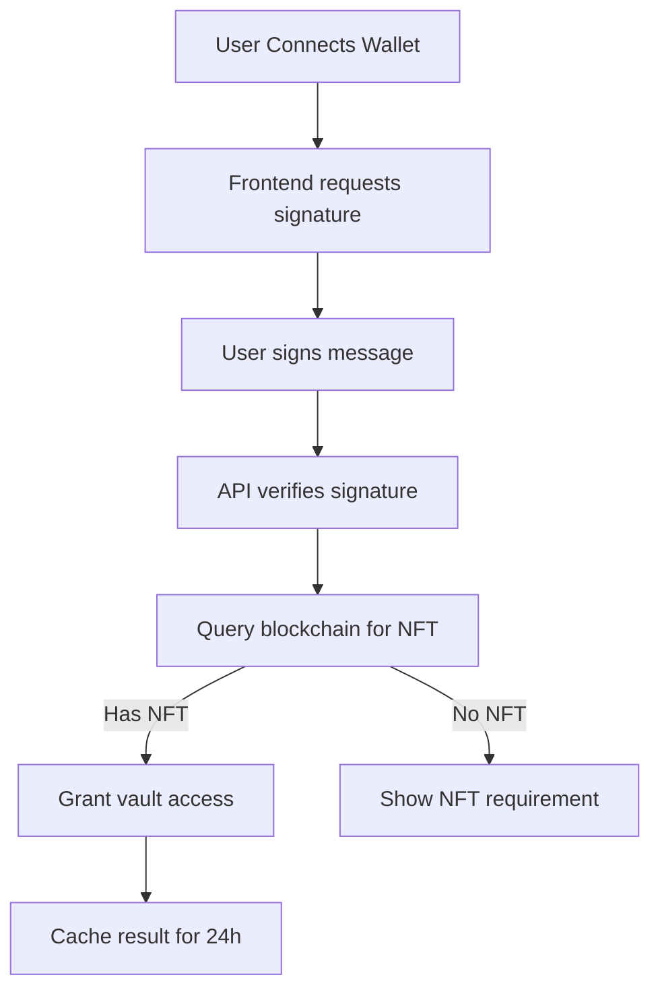

# Aurum Circle Miniapp - World-Class Architecture

## 🏗️ **System Architecture Overview**

This is a Tinder-like dating miniapp with Web3 authentication and NFT gating, built for exclusive access to a secret society-themed platform.

### **Architecture Principles**
- **Microservices-Ready**: Modular API design for horizontal scaling
- **Web3-First**: Blockchain authentication as primary identity layer
- **Privacy-Centric**: Zero-knowledge matching, encrypted communications
- **Mobile-Optimized**: PWA-ready, offline-capable core features
- **Event-Driven**: Real-time notifications and matching system
- **GDPR Compliant**: User data ownership and deletion rights

---

## 🎯 **Core Business Logic**

### **User Journey Flow**
```
Entry → World ID Auth → NFT Verification → Profile Setup → Vault Access → Matching → Communication
```

### **Matching Algorithm (Tinder-Style)**
1. **Double Opt-In**: Both users must send "secret signals" to match
2. **Proximity Aware**: Bangkok students only (geo-filtering)
3. **Interest-Based**: Tag system (Wicked, Royal, Mystic vibes)
4. **Exclusivity**: NFT holders only, limited invite system
5. **Anti-Spam**: Rate limiting, World ID prevents bots

### **Invite System Economics**
- Each user gets **3 invite codes** maximum
- Codes expire after **30 days** if unused
- Successfully used invites grant **1 additional invite** to inviter
- Viral coefficient target: **1.2x** (each user brings 1.2 new users)

---

## 🔐 **Security Architecture**

### **Authentication Layers**
1. **L1 - World ID**: Proof of humanity (Worldcoin verification)
2. **L2 - NFT Gate**: Ownership verification via wallet signature
3. **L3 - Session**: JWT tokens with 24h expiry, refresh rotation
4. **L4 - CSRF**: Double-submit cookies for state-changing operations

### **Privacy Protection**
- **Profile Blurring**: Images processed server-side, blur levels configurable
- **Zero-Knowledge Matching**: Users don't see who they signaled until mutual
- **Data Minimization**: Only store essential data, aggressive pruning
- **Encryption**: All sensitive data encrypted at rest (AES-256)

### **Anti-Abuse Systems**
- **Rate Limiting**: 
  - Signals: 50/day per user
  - Profile views: 200/day per user
  - Invite claims: 5/hour globally
- **Spam Detection**: ML model for fake profiles (future phase)
- **Report System**: Community moderation with admin review

---

## 🏛️ **Technical Architecture**

### **Frontend Architecture**
```
Next.js 14 App Router
├── app/
│   ├── (auth)/           # Auth-required routes
│   ├── (public)/         # Public routes (splash, login)
│   ├── api/              # API routes
│   └── globals.css
├── components/
│   ├── ui/               # Shadcn/ui components
│   ├── features/         # Feature-specific components
│   └── layout/           # Layout components
├── lib/
│   ├── auth/             # Authentication logic
│   ├── blockchain/       # Web3 integrations
│   ├── database/         # Database clients
│   └── utils/            # Utilities
└── types/                # TypeScript types
```

### **State Management Strategy**
- **React Query**: Server state, caching, background sync
- **Zustand**: Client-side UI state (theme, user preferences)
- **React Context**: Authentication state
- **Local Storage**: User preferences, draft messages

### **Database Design (Cloudflare R2 + D1)**

#### **Core Entities**
```typescript
// Users Collection
interface User {
  id: string              // UUID
  worldId: string         // Worldcoin nullifier hash
  walletAddress: string   // Ethereum address
  handle: string          // @username
  displayName: string     
  bio?: string
  profileImage: string    // R2 URL
  blurredImage: string    // Auto-generated blurred version
  vibe: 'Wicked' | 'Royal' | 'Mystic'
  tags: string[]          // Interests
  nftVerified: boolean
  lastSeen: Date
  createdAt: Date
  status: 'active' | 'suspended' | 'deleted'
}

// Matches Collection
interface Match {
  id: string
  user1Id: string
  user2Id: string
  matchedAt: Date
  conversationId?: string  // Created after match
  status: 'pending' | 'matched' | 'unmatched'
}

// Signals Collection (Swipe equivalent)
interface Signal {
  id: string
  fromUserId: string
  toUserId: string
  type: 'interest' | 'super_interest' | 'pass'
  sentAt: Date
  metadata?: {
    message?: string      // Optional message with signal
  }
}

// Invites Collection
interface Invite {
  id: string
  code: string            // Human-readable code (AURUM-X123)
  createdBy: string       // User ID
  claimedBy?: string      // User ID who claimed
  claimedAt?: Date
  expiresAt: Date
  maxUses: number         // Default: 1
  currentUses: number
  status: 'active' | 'expired' | 'exhausted'
}
```

---

## 🔌 **API Architecture**

### **RESTful API Design**
```
Authentication & Authorization
POST   /api/auth/worldid              # World ID verification
POST   /api/auth/wallet               # Wallet signature verification  
GET    /api/auth/session              # Get current session
DELETE /api/auth/logout               # Logout and invalidate tokens

User Management
GET    /api/users/me                  # Current user profile
PUT    /api/users/me                  # Update profile
POST   /api/users/me/upload           # Upload profile image
GET    /api/users/:id                 # Get user by ID (limited data)
DELETE /api/users/me                  # Delete account

NFT & Access Control
GET    /api/nft/verify/:address       # Check NFT ownership
GET    /api/access/gate                # Check user access level

Discovery & Matching
GET    /api/discovery/profiles        # Get potential matches (paginated)
POST   /api/signals                   # Send interest signal
GET    /api/signals/received          # Get received signals
GET    /api/matches                   # Get current matches
DELETE /api/matches/:id               # Unmatch

Invite System
GET    /api/invites/me                # My invite codes
POST   /api/invites                   # Generate new invite
GET    /api/invites/:code             # Validate invite code
POST   /api/invites/:code/claim       # Claim invite code
GET    /api/invites/claims            # Who claimed my invites

Scoring System
POST   /api/score                     # Calculate final user score

Real-time Features (WebSockets)
WS     /api/ws                        # WebSocket connection
       Events: new_match, new_message, signal_received
```

### **Rate Limiting Strategy**
```typescript
// Rate limits by endpoint
const RATE_LIMITS = {
  '/api/signals': '50/day',           // Prevent spam signaling
  '/api/discovery/profiles': '500/hour', // Reasonable browsing
  '/api/invites': '1/hour',           // Prevent invite farming
  '/api/invites/*/claim': '5/hour',   // Prevent abuse
  '/api/auth/*': '10/minute',         // Prevent brute force
  '/api/users/me/upload': '5/hour',   // Prevent storage abuse
}
```

---

## 📊 **Data Flow Architecture**

### **Real-Time Matching Flow**


### **NFT Verification Flow**


---

## 🚀 **Performance & Scalability**

### **Caching Strategy**
- **CDN**: Static assets, profile images via Cloudflare
- **API Cache**: Profile data (5min), NFT status (24h)
- **Client Cache**: React Query with 30s stale time
- **Database**: Optimized queries with proper indexing

### **Image Optimization**
- **Upload**: WebP conversion, multiple sizes (50x50, 200x200, 400x400)
- **Blur Generation**: Server-side blur for privacy
- **Lazy Loading**: Intersection Observer for profile cards
- **Progressive**: Base64 thumbnails while loading

### **Mobile Performance**
- **Bundle Size**: <300KB initial, code splitting by route
- **Offline**: Service Worker for profile cache
- **PWA**: App-like experience, install prompt
- **Touch**: Gesture recognition for swipe actions

---

## 🔧 **Development Architecture**

### **Development Workflow**
```
Feature Branch → PR → Code Review → Staging Deploy → Production Deploy
```

### **Testing Strategy**
- **Unit Tests**: Jest + Testing Library (80% coverage)
- **Integration**: API endpoint tests with mock blockchain
- **E2E**: Playwright for critical user journeys
- **Performance**: Lighthouse CI, Core Web Vitals monitoring
- **Security**: OWASP ZAP, dependency scanning

### **Deployment Architecture**
- **Frontend**: Vercel (Edge Functions for API)
- **Database**: Cloudflare D1 (SQLite) + R2 (File Storage)
- **CDN**: Cloudflare (Global edge distribution)
- **Monitoring**: Vercel Analytics + Custom error tracking
- **Backup**: Daily R2 snapshots, point-in-time recovery

---

## 📈 **Analytics & Growth**

### **Key Metrics**
- **Activation**: % of World ID users who complete profile
- **Engagement**: Daily active users, session duration
- **Matching**: Signal success rate, match completion rate
- **Retention**: D1, D7, D30 retention rates
- **Viral**: K-factor, invite conversion rates

### **A/B Testing Framework**
- **Profile Recommendations**: Algorithm variations
- **UI/UX**: Swipe gestures vs button taps
- **Onboarding**: Different vibe selection flows
- **Notifications**: Push timing and content optimization

---

## 🛡️ **Compliance & Legal**

### **Data Protection**
- **GDPR**: Right to deletion, data portability
- **CCPA**: California privacy compliance
- **Thailand PDPA**: Local data protection law
- **Age Verification**: 18+ only, university email verification

### **Content Moderation**
- **Image Scanning**: NSFW detection via ML
- **Text Filtering**: Hate speech, harassment detection
- **Community Reports**: User reporting system
- **Admin Dashboard**: Moderation queue and tools

---

This architecture supports a world-class dating app with Web3 features, designed for scale, security, and user experience excellence. Ready for implementation! 🎭✨