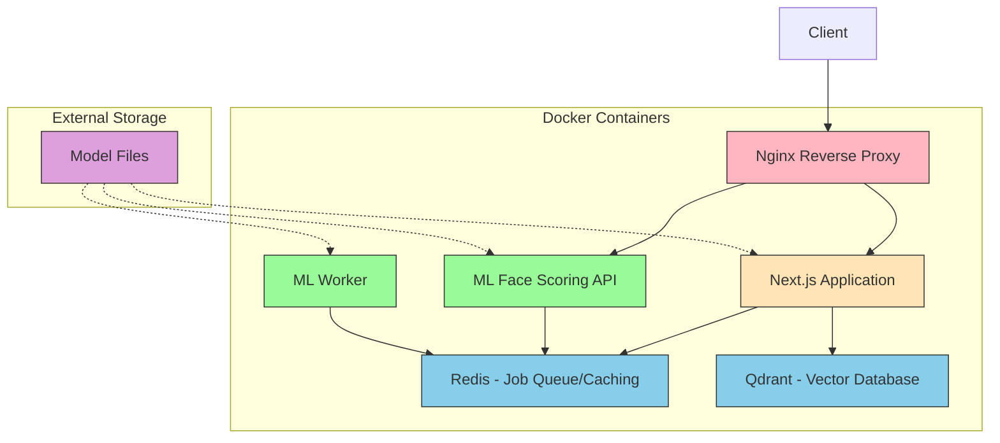
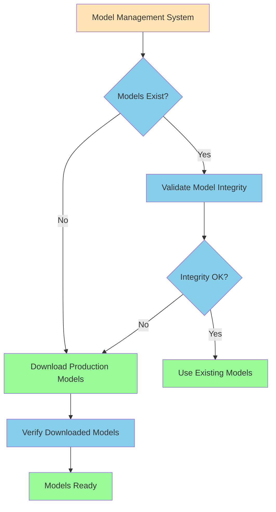

# Deployment Architecture

## System Architecture Diagram

## Deployment Workflow

```mermaid
graph LR
    A[Start Deployment] --> B[Validate Environment]
    B --> C[Check Required Directories]
    C --> D[Create Missing Directories]
    D --> E[Download/Validate Models]
    E --> F[Build Docker Images]
    F --> G[Start Services with Docker Compose]
    G --> H[Verify Service Health]
    H --> I[Deployment Complete]

    style A fill:#FFE4B5
    style B fill:#87CEEB
    style C fill:#87CEEB
    style D fill:#98FB98
    style E fill:#98FB98
    style F fill:#DDA0DD
    style G fill:#DDA0DD
    style H fill:#87CEEB
    style I fill:#98FB98
```

## Model Management Workflow

## Component Descriptions

### Next.js Application

- Main web application serving the frontend
- Handles user interactions and API requests
- Connects to Redis for job queue and caching
- Connects to Qdrant for vector database operations

### ML Face Scoring API

- REST API for facial attractiveness scoring
- Receives image processing requests
- Queues jobs in Redis for processing
- Returns scoring results to the frontend

### ML Worker

- Background worker processes for ML computations
- Processes jobs from Redis queue
- Uses ONNX Runtime and TensorFlow.js for model inference
- Returns results to the API service

### Redis

- Job queue for distributing work between services
- Caching layer for improved performance
- Shared state management between services

### Qdrant

- Vector database for storing and searching facial embeddings
- Used for similarity matching and clustering
- Handles vector similarity searches efficiently

### Nginx Reverse Proxy

- Routes incoming requests to appropriate services
- Handles SSL termination
- Provides load balancing capabilities
- Serves static assets efficiently

### Model Files

- External storage for ML model files
- Contains face detection and face embedding models
- Mounted as volumes to services that need them
- Managed separately for easier updates
