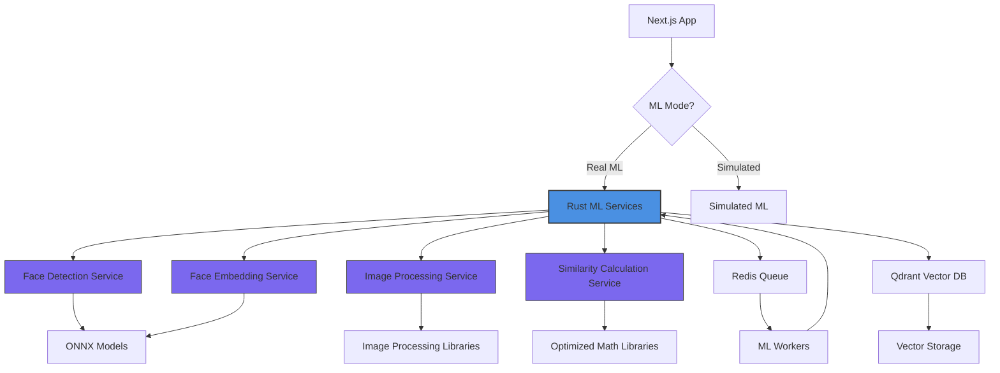
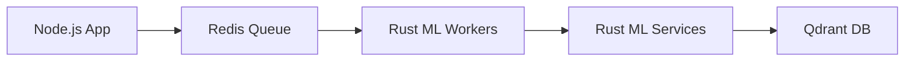

# Aurum Circle Miniapp - Rust-Based ML Architecture

## Overview

This document outlines the architecture for migrating the current machine learning components from simulated JavaScript/TypeScript implementations to production-ready Rust-based services. The Rust implementation will provide significant performance improvements, better memory safety, and reduced maintenance costs compared to the current Python-based approach.

## Rust-Based ML Services Architecture

### 1. Face Detection Service (`face-detection-service`)

- **Technology**: Rust with ONNX Runtime
- **Model**: MediaPipe BlazeFace or MTCNN
- **Interface**: RESTful API + gRPC
- **Port**: 8001
- **Purpose**: High-performance face detection with landmark extraction

### 2. Face Embedding Service (`face-embedding-service`)

- **Technology**: Rust with ONNX Runtime
- **Model**: ArcFace or InsightFace
- **Interface**: RESTful API + gRPC
- **Port**: 8002
- **Purpose**: Face embedding extraction for similarity calculations

### 3. Image Processing Service (`image-processing-service`)

- **Technology**: Rust with Image crate
- **Purpose**: Image preprocessing, alignment, and optimization
- **Interface**: RESTful API + gRPC
- **Port**: 8003

### 4. Similarity Calculation Service (`similarity-service`)

- **Technology**: Rust with optimized linear algebra
- **Purpose**: High-performance cosine similarity calculations
- **Interface**: RESTful API + gRPC
- **Port**: 8004

## System Architecture Diagram



## Service Specifications

### Face Detection Service

- **Input**: Base64 encoded image or image URL
- **Output**:
  ```json
  {
    "faces": [
      {
        "bbox": { "x": 100, "y": 100, "width": 200, "height": 200 },
        "landmarks": {
          "left_eye": [150, 140],
          "right_eye": [250, 140],
          "nose": [200, 180],
          "left_mouth": [170, 220],
          "right_mouth": [230, 220]
        },
        "confidence": 0.95
      }
    ]
  }
  ```
- **Performance**: < 50ms for 512x512 images
- **Models**: BlazeFace (192x192) or MTCNN (P-Net, R-Net, O-Net)

### Face Embedding Service

- **Input**: Base64 encoded face image or face crop
- **Output**:
  ```json
  {
    "embedding": [0.123, -0.456, 0.789, ...], // 512-dim vector
    "quality": 0.92,
    "confidence": 0.88
  }
  ```
- **Performance**: < 80ms for 112x112 face crops
- **Models**: ArcFace ResNet100 or InsightFace

### Image Processing Service

- **Input**: Base64 encoded image
- **Output**: Processed image or metadata
- **Features**:
  - Image resizing and normalization
  - Face alignment based on landmarks
  - Image quality assessment
  - Format conversion

### Similarity Calculation Service

- **Input**: Two face embeddings or batch of embeddings
- **Output**: Similarity scores
- **Performance**: < 1ms for single comparison, < 10ms for 1000 comparisons
- **Algorithms**: Cosine similarity, Euclidean distance

## Integration with Existing System

### API Interface

The Rust services will expose RESTful APIs that are compatible with the existing Node.js services:

```
POST /api/detect-face
POST /api/extract-embedding
POST /api/process-image
POST /api/calculate-similarity
GET /api/health
GET /api/status
```

### Queue Integration

The existing BullMQ queue system will continue to be used, but workers will call the Rust services instead of the simulated functions:



### Data Flow

1. User uploads image to Next.js app
2. Next.js app validates and queues job in Redis
3. Rust ML Worker picks up job from Redis
4. Worker calls Rust ML Services for processing
5. Results are stored in Qdrant vector database
6. Next.js app retrieves results from Qdrant

## Rust Implementation Plan

### 1. Core Dependencies

```toml
[dependencies]
actix-web = "4.0"           # Web framework
tokio = { version = "1.0", features = ["full"] }
serde = { version = "1.0", features = ["derive"] }
serde_json = "1.0"
image = "0.24"              # Image processing
ort = "1.15"                # ONNX Runtime
ndarray = "0.15"            # N-dimensional arrays
redis = "0.23"              # Redis client
reqwest = { version = "0.11", features = ["json"] }
tokio-postgres = "0.7"      # PostgreSQL client (if needed)
```

### 2. Service Structure

```
rust-ml-services/
├── Cargo.toml
├── face-detection-service/
│   ├── src/
│   │   ├── main.rs
│   │   ├── api/
│   │   ├── models/
│   │   └── utils/
│   └── Cargo.toml
├── face-embedding-service/
│   ├── src/
│   │   ├── main.rs
│   │   ├── api/
│   │   ├── models/
│   │   └── utils/
│   └── Cargo.toml
├── image-processing-service/
│   ├── src/
│   │   ├── main.rs
│   │   ├── api/
│   │   └── processors/
│   └── Cargo.toml
└── similarity-service/
    ├── src/
    │   ├── main.rs
    │   ├── api/
    │   └── calculators/
    └── Cargo.toml
```

## Performance Improvements

### 1. Memory Efficiency

- Rust's zero-cost abstractions and memory safety
- No garbage collection overhead
- Efficient memory management with ownership system

### 2. Processing Speed

- Compiled to native code
- Optimized linear algebra operations
- Parallel processing capabilities

### 3. Resource Utilization

- Lower CPU and memory footprint
- Better concurrency handling
- Efficient I/O operations

## Deployment Architecture

### Docker Services

```yaml
services:
  # Existing services remain unchanged
  app:
    # ... existing configuration

  redis:
    # ... existing configuration

  qdrant:
    # ... existing configuration

  # New Rust services
  face-detection-service:
    build: ./rust-ml-services/face-detection-service
    ports:
      - "8001:8001"
    environment:
      - REDIS_URL=redis://redis:6379
      - MODEL_PATH=/models/blazeface.onnx
    volumes:
      - ./models:/models
    restart: unless-stopped

  face-embedding-service:
    build: ./rust-ml-services/face-embedding-service
    ports:
      - "8002:8002"
    environment:
      - REDIS_URL=redis://redis:6379
      - MODEL_PATH=/models/arcface.onnx
    volumes:
      - ./models:/models
    restart: unless-stopped

  image-processing-service:
    build: ./rust-ml-services/image-processing-service
    ports:
      - "8003:8003"
    environment:
      - REDIS_URL=redis://redis:6379
    restart: unless-stopped

  similarity-service:
    build: ./rust-ml-services/similarity-service
    ports:
      - "8004:8004"
    environment:
      - REDIS_URL=redis://redis:6379
    restart: unless-stopped
```

## Model Integration

### 1. Model Formats

- ONNX models for cross-platform compatibility
- Pre-converted models from TensorFlow/PyTorch
- Optimized for inference (quantized where possible)

### 2. Model Loading

- Lazy loading on service startup
- Model validation and health checks
- Fallback to simulated mode if models unavailable

### 3. Model Updates

- Hot-swapping capability for model updates
- Version management for models
- A/B testing support

## Error Handling and Monitoring

### 1. Error Types

- Model loading failures
- Input validation errors
- Processing timeouts
- Resource exhaustion

### 2. Monitoring

- Health check endpoints for each service
- Performance metrics (latency, throughput)
- Error rate tracking
- Resource utilization monitoring

### 3. Fallback Mechanisms

- Graceful degradation to simulated mode
- Automatic retry mechanisms
- Circuit breaker patterns for service failures

## Security Considerations

### 1. Input Validation

- Image format validation
- Size limits and dimension checks
- Malformed data detection

### 2. Resource Limits

- Memory usage caps
- Processing time limits
- Concurrent request limits

### 3. Network Security

- Service-to-service authentication
- TLS encryption for data in transit
- Rate limiting to prevent abuse

## Scalability Features

### 1. Horizontal Scaling

- Stateless services for easy scaling
- Load balancing support
- Shared Redis and Qdrant backends

### 2. Caching

- Model caching in memory
- Frequently accessed results caching
- CDN integration for static assets

### 3. Batch Processing

- Batch inference for multiple images
- Queue optimization for bulk processing
- Resource pooling for efficient utilization

## Testing Strategy

### 1. Unit Tests

- Individual function testing
- Model accuracy validation
- Performance benchmarks

### 2. Integration Tests

- Service-to-service communication
- Database integration
- Queue processing validation

### 3. Load Testing

- Concurrent user simulation
- Stress testing under high load
- Performance regression detection

## Migration Path

### Phase 1: Development

- Implement core Rust services
- Create API compatibility layer
- Set up testing infrastructure

### Phase 2: Integration

- Replace simulated ML components
- Integrate with existing queue system
- Performance optimization

### Phase 3: Deployment

- Docker containerization
- Production deployment setup
- Monitoring and alerting

### Phase 4: Optimization

- Performance tuning
- Resource optimization
- Advanced features implementation
